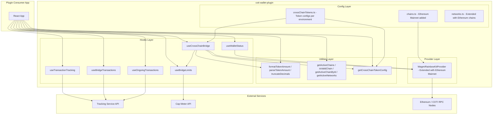

# Design Document: Cross-Chain Bridge Functions Integration

## Overview

This design integrates cross-chain bridge functionality (COTI ↔ Ethereum token transfers) into the existing `coti-wallet-plugin` library. The cross-chain bridge is fundamentally different from the existing privacy bridge: while the privacy bridge moves tokens between public and private states on the same COTI chain, the cross-chain bridge transfers tokens between COTI networks and Ethereum networks via native transfers and ERC20 `transfer()` calls to designated recipient addresses.

The integration adds:
- A `useCrossChainBridge` hook for executing bridge transactions (native and ERC20)
- A `useTransactionTracking` hook for polling transaction progress through stages
- A `useBridgeTransactions` hook for paginated transaction history
- A `useBridgeLimits` hook for querying user/global daily limits from the Cap Meter API
- A `useWalletStatus` hook for chain validation and network switching
- A `useOngoingTransactions` hook for monitoring all in-progress bridge operations
- Utility functions for token amount formatting/parsing, network management, and token configuration
- Ethereum Mainnet chain definition added to the existing chains config and wagmi provider

All new modules follow existing plugin conventions: wagmi/viem for contract interactions, React hooks for stateful logic, and TypeScript types exported from `src/index.ts`.

## Architecture



### Design Decisions

1. **Wagmi hooks for transactions**: `useSendTransaction` for native transfers and `useWriteContract` for ERC20 transfers — consistent with the existing plugin's approach and avoids introducing ethers for write operations.

2. **Polling-based tracking**: The tracking service is external and does not support WebSocket subscriptions. Polling with configurable intervals (default 10s) matches the existing `useBridgeData` pattern.

3. **Environment-based chain pair resolution**: Rather than hardcoding chain pairs, the system dynamically resolves testnet vs mainnet based on the connected wallet's chain ID. This mirrors how the existing `useBridgeData` hook selects RPC URLs.

4. **Separate cross-chain token config**: A new `crossChainTokens.ts` file keeps cross-chain bridge token configurations (with recipient addresses) separate from the existing privacy bridge token configs in `contracts/config.ts`, avoiding confusion between the two bridge types.

5. **In-memory ongoing transaction registry**: Ongoing transactions are stored in a module-level registry (outside React state) so they persist across hook mount/unmount cycles within the same session. This avoids localStorage complexity while satisfying the requirement for persistence across remounts.

## Components and Interfaces

### New Files

| File | Purpose |
|------|---------|
| `src/hooks/useCrossChainBridge.ts` | Bridge transaction execution hook |
| `src/hooks/useTransactionTracking.ts` | Transaction progress polling hook |
| `src/hooks/useBridgeTransactions.ts` | Paginated transaction history hook |
| `src/hooks/useBridgeLimits.ts` | Daily limits polling hook |
| `src/hooks/useWalletStatus.ts` | Wallet status and chain validation hook |
| `src/hooks/useOngoingTransactions.ts` | Ongoing transactions monitoring hook |
| `src/config/crossChainTokens.ts` | Cross-chain token configurations |
| `src/lib/crossChainUtils.ts` | Token amount utilities and network helpers |

### Modified Files

| File | Change |
|------|--------|
| `src/config/chains.ts` | Add `ethereumMainnet` chain definition, `ETHEREUM_MAINNET_CHAIN_ID`, `ETHEREUM_MAINNET_RPC`, update `getRpcUrlForChainId` |
| `src/providers/WagmiRainbowKitProvider.tsx` | Add `ethereumMainnet` to chains array and transports |
| `src/config/networks.ts` | Add Ethereum Mainnet and Sepolia to `NETWORK_CONFIGS` |
| `src/index.ts` | Export all new hooks, types, utilities, and configurations |

### Hook Interfaces

```typescript
// useCrossChainBridge
interface UseCrossChainBridgeResult {
  bridgeNative: (amount: bigint, tokenId: string) => Promise<void>;
  bridgeERC20: (amount: bigint, tokenId: string, tokenAddress: `0x${string}`) => Promise<void>;
  isLoading: boolean;
  error: BridgeError | null;
  txHash: string | null;
}

interface BridgeError {
  code: 'DAILY_LIMIT_EXCEEDED' | 'BELOW_MINIMUM' | 'INSUFFICIENT_BALANCE' | 'GAS_ESTIMATION_FAILED' | 'TRANSACTION_FAILED' | 'UNSUPPORTED_TOKEN';
  message: string;
  details?: {
    remainingAllowance?: string;
    requiredMinimum?: string;
    currentBalance?: string;
  };
}

// useTransactionTracking
interface UseTransactionTrackingResult {
  currentStep: number | null;
  destinationHash: string | null;
  failureReason: string | null;
  failedStep: number | null;
  fee: string | null;
  isLoading: boolean;
  error: string | null;
}

// useBridgeTransactions
interface BridgeTransaction {
  txHash: string;
  tokenId: string;
  amount: string;
  sourceChainId: number;
  destinationChainId: number;
  timestamp: number;
  currentStep: number;
  isCompleted: boolean;
  destinationHash: string | null;
}

interface UseBridgeTransactionsResult {
  transactions: BridgeTransaction[];
  totalCount: number;
  isLoading: boolean;
  error: string | null;
}

// useBridgeLimits
interface UseBridgeLimitsResult {
  userDailyLimit: string;
  globalDailyLimit: string;
  isLoading: boolean;
  error: string | null;
}

// useWalletStatus
interface UseWalletStatusResult {
  isConnected: boolean;
  address: string;
  chainId: number | null;
  isValidChain: boolean;
  switchChain: (chainId: number) => Promise<void>;
  switchError: string | null;
  disconnect: () => void;
}

// useOngoingTransactions
interface OngoingTransaction {
  tokenId: string;
  sourceChainId: number;
  destinationChainId: number;
  txHash: string;
  currentStep: number;
  destinationHash: string | null;
  failureReason: string | null;
  isLoading: boolean;
  initiatedAt: number;
}

interface UseOngoingTransactionsResult {
  transactions: OngoingTransaction[];
}
```

### Utility Function Interfaces

```typescript
// Token amount utilities (src/lib/crossChainUtils.ts)
function formatTokenAmount(value: bigint, decimals: number): string;
function parseTokenAmount(value: string, decimals: number): bigint;
function truncateDecimals(value: string, maxDecimals: number): string;

// Network management (src/lib/crossChainUtils.ts)
interface ChainConfig {
  chainId: number;
  networkName: string;
  rpcUrl: string;
  explorerUrl: string;
  isTestnet: boolean;
}

interface ChainPair {
  coti: ChainConfig;
  ethereum: ChainConfig;
}

function getActiveChains(connectedChainId?: number): ChainPair[];
function isValidChain(chainId: number, connectedChainId?: number): boolean;
function getActiveChainById(chainId: number, connectedChainId?: number): ChainConfig | undefined;
function getActiveNetworks(connectedChainId?: number): ChainConfig[];

// Token configuration (src/config/crossChainTokens.ts)
interface CrossChainTokenConfig {
  tokenId: string;
  symbol: string;
  name: string;
  contractAddress: `0x${string}`;
  decimals: number;
  recipientAddress: `0x${string}`;
}

function getCrossChainTokenConfig(tokenId: string, chainId: number): CrossChainTokenConfig | undefined;
```

## Data Models

### Cross-Chain Token Configuration

```typescript
// Per-environment token configs with recipient addresses
const CROSS_CHAIN_TOKENS: Record<'testnet' | 'mainnet', Record<string, Record<number, CrossChainTokenConfig>>> = {
  testnet: {
    'COTI': {
      7082400: {  // COTI Testnet
        tokenId: 'COTI',
        symbol: 'COTI',
        name: 'COTI',
        contractAddress: '0x0000000000000000000000000000000000000000', // native
        decimals: 18,
        recipientAddress: '0x...', // bridge recipient on COTI Testnet
      },
      11155111: {  // Sepolia
        tokenId: 'COTI',
        symbol: 'COTI',
        name: 'COTI',
        contractAddress: '0x...', // ERC20 COTI on Sepolia
        decimals: 18,
        recipientAddress: '0x...', // bridge recipient on Sepolia
      },
    },
    'gCOTI': {
      7082400: { /* ... */ },
      11155111: { /* ... */ },
    },
  },
  mainnet: {
    'COTI': {
      2632500: { /* ... */ },
      1: { /* ... */ },
    },
    'gCOTI': {
      2632500: { /* ... */ },
      1: { /* ... */ },
    },
  },
};
```

### Chain Pair Resolution

```typescript
const CHAIN_PAIRS: Record<'testnet' | 'mainnet', ChainPair> = {
  testnet: {
    coti: { chainId: 7082400, networkName: 'COTI Testnet', rpcUrl: 'https://testnet.coti.io/rpc', explorerUrl: 'https://testnet.cotiscan.io', isTestnet: true },
    ethereum: { chainId: 11155111, networkName: 'Sepolia', rpcUrl: 'https://ethereum-sepolia-rpc.publicnode.com', explorerUrl: 'https://sepolia.etherscan.io', isTestnet: true },
  },
  mainnet: {
    coti: { chainId: 2632500, networkName: 'COTI Mainnet', rpcUrl: 'https://mainnet.coti.io/rpc', explorerUrl: 'https://mainnet.cotiscan.io', isTestnet: false },
    ethereum: { chainId: 1, networkName: 'Ethereum Mainnet', rpcUrl: 'https://eth.llamarpc.com', explorerUrl: 'https://etherscan.io', isTestnet: false },
  },
};
```

### Ongoing Transaction Registry (Module-Level)

```typescript
// Module-level store persists across hook mount/unmount
const ongoingRegistry: Map<string, OngoingTransaction> = new Map();
```

### Tracking API Response Shape

```typescript
interface TrackingApiResponse {
  status: 'pending' | 'done' | 'failed' | 'refunded';
  step: number;
  destinationHash?: string;
  failureReason?: string;
  fee?: string;
}
```

### Transaction History API Response Shape

```typescript
interface TransactionHistoryApiResponse {
  transactions: Array<{
    txHash: string;
    tokenId: string;
    amount: string;
    sourceNetworkId: number;
    destinationNetworkId: number;
    timestamp: number;
    status: string;
    step: number;
    destinationHash?: string;
  }>;
  total: number;
}
```


## Correctness Properties

### Property 1: Token Amount Round-Trip

**Validates: Requirements 9.5**

For any non-negative bigint value `v` and decimal count `d` (0 ≤ d ≤ 18):
```
parseTokenAmount(formatTokenAmount(v, d), d) === v
```

This ensures no precision loss during formatting and parsing operations.

### Property 2: Chain Pair Consistency

**Validates: Requirements 7.1, 7.2, 7.3**

For any chain ID `c` returned by `getActiveChains()`:
```
isValidChain(c.coti.chainId) === true
isValidChain(c.ethereum.chainId) === true
getActiveChainById(c.coti.chainId) !== undefined
getActiveChainById(c.ethereum.chainId) !== undefined
```

All chains in an active pair must be individually valid and retrievable.

### Property 3: Token Config Completeness

**Validates: Requirements 6.1, 6.3**

For any token ID `t` and chain ID `c` where `getCrossChainTokenConfig(t, c)` returns a config:
```
config.contractAddress is a valid 0x-prefixed hex string of length 42
config.decimals >= 0 && config.decimals <= 18
config.recipientAddress is a valid 0x-prefixed hex string of length 42
```

### Property 4: Bridge Limit Invariant

**Validates: Requirements 4.1, 4.2**

For any user daily limit response:
```
userDailyLimit.remaining <= userDailyLimit.max
userDailyLimit.used + userDailyLimit.remaining === userDailyLimit.max
```

### Property 5: Transaction Step Monotonicity

**Validates: Requirements 2.1, 2.4**

For any ongoing transaction being tracked, the `currentStep` value SHALL be monotonically non-decreasing across successive polling responses (steps never go backwards).

### Property 6: Ongoing Registry Terminal Removal

**Validates: Requirements 8.4**

For any transaction `tx` in the ongoing registry:
```
IF tx.status ∈ {done, failed, refunded} THEN tx ∉ ongoingRegistry (after next poll cycle)
```

Transactions in terminal states are always removed from the registry.

## Error Handling

### Transaction Execution Errors

| Error Code | Trigger | User-Facing Message |
|---|---|---|
| `DAILY_LIMIT_EXCEEDED` | Amount > remaining daily limit | "Transfer amount exceeds your daily limit. Remaining: {remaining}" |
| `BELOW_MINIMUM` | Amount < minimum for token | "Amount is below the minimum of {minimum} {symbol}" |
| `INSUFFICIENT_BALANCE` | Balance < amount + gas | "Insufficient balance for this transfer including gas fees" |
| `GAS_ESTIMATION_FAILED` | Gas estimation RPC error | (Internal — falls back to 12M gas, no user error) |
| `TRANSACTION_FAILED` | On-chain revert or rejection | "Transaction failed: {reason}" |
| `UNSUPPORTED_TOKEN` | Token ID not in config | "Token {tokenId} is not supported for cross-chain bridge" |

### API Error Handling

- **Tracking Service**: Network errors during polling are propagated to the caller but do not stop the polling cycle. The hook continues retrying at the configured interval.
- **Cap Meter API**: On failure, the last successfully fetched values are retained. The error state is set with a descriptive message.
- **Transaction History API**: On failure, previously cached data is preserved. Error state is set.

### Network Switch Errors

When `switchChain` fails (user rejection or RPC error), the `switchError` field is populated with the failure reason. The current chain ID and connection status remain unchanged.

### Graceful Degradation

- If the Cap Meter API is unreachable, bridge transactions can still be submitted (limit validation is skipped with a warning).
- If the Tracking Service is unreachable, transactions are still submitted but tracking shows a loading/error state.
- If gas estimation fails, the fallback gas limit (12M) is used automatically.

## Testing Strategy

### Unit Tests

| Module | Test Focus |
|---|---|
| `crossChainUtils.ts` | `formatTokenAmount`, `parseTokenAmount`, `truncateDecimals` — boundary values, round-trip property |
| `crossChainUtils.ts` | `getActiveChains`, `isValidChain`, `getActiveChainById`, `getActiveNetworks` — environment resolution, edge cases |
| `crossChainTokens.ts` | `getCrossChainTokenConfig` — valid/invalid token IDs, valid/invalid chain IDs |
| `chains.ts` | `getRpcUrlForChainId` — all chain IDs including new Ethereum Mainnet |

### Property-Based Tests

| Property | Generator | Assertion |
|---|---|---|
| Round-trip | Random bigint (0 to 10^36), random decimals (0-18) | `parseTokenAmount(formatTokenAmount(v, d), d) === v` |
| Chain pair consistency | Random chain ID from active pairs | All pair members are individually valid |
| Truncate idempotence | Random numeric string, random max decimals | `truncateDecimals(truncateDecimals(s, d), d) === truncateDecimals(s, d)` |

### Integration Tests

| Scenario | Approach |
|---|---|
| Bridge execution (native) | Mock wagmi's `useSendTransaction` — verify correct recipient and value |
| Bridge execution (ERC20) | Mock wagmi's `useWriteContract` — verify correct contract address, function, and args |
| Transaction tracking | Mock fetch — verify polling starts, stops on terminal state, handles errors |
| Bridge limits | Mock fetch — verify polling, error retention, refresh behavior |
| Wallet status | Mock wagmi's `useAccount`, `useSwitchChain` — verify chain validation and switching |
| Ongoing transactions | Verify registry add/remove lifecycle, persistence across remounts |

### Manual Testing Checklist

- [ ] Bridge native COTI from COTI Testnet to Sepolia
- [ ] Bridge gCOTI (ERC20) from COTI Testnet to Sepolia
- [ ] Bridge COTI from Sepolia to COTI Testnet
- [ ] Verify transaction tracking shows correct step progression
- [ ] Verify daily limits are displayed and enforced
- [ ] Verify network switch prompt when on wrong chain
- [ ] Verify ongoing transactions persist across page navigation
- [ ] Verify existing privacy bridge functionality is unaffected
