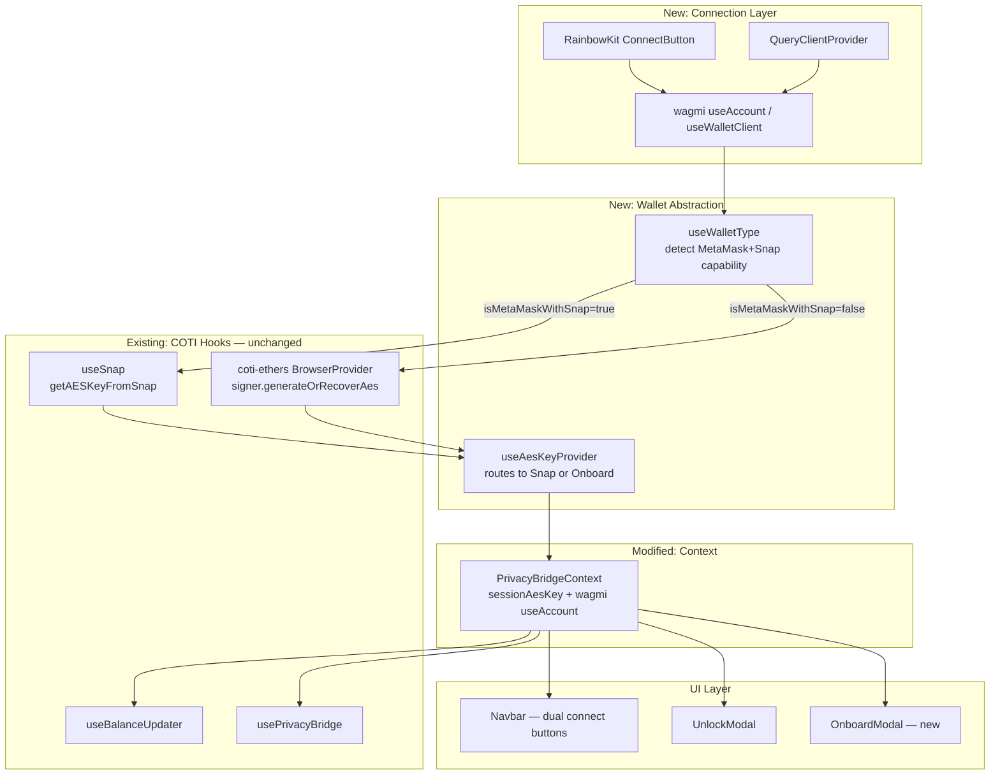
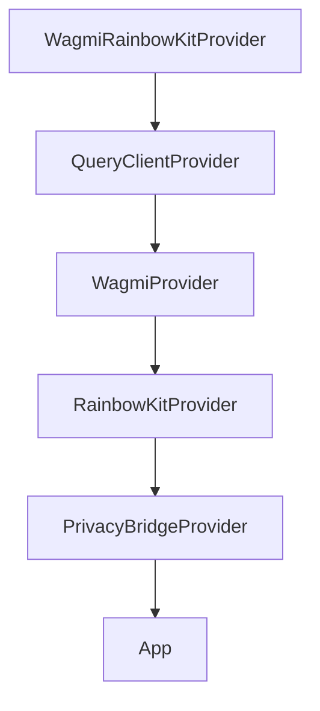
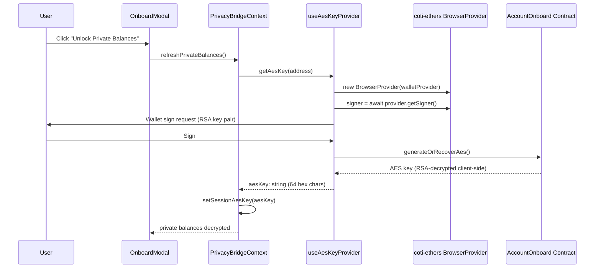
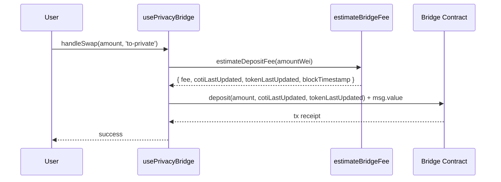

# Design Document: Wallet Plugin Bridge Update

## Overview

This design updates `@coti-io/coti-wallet-plugin` to support the new portal-bridge architecture with RainbowKit + wagmi v2 for multi-wallet support. The core change introduces a **wallet abstraction layer** that routes AES key retrieval to either the existing MetaMask Snap path or a new onboarding contract path (`@coti-io/coti-ethers` `signer.generateOrRecoverAes()`) depending on the connected wallet type.

The existing MetaMask + Snap flow is preserved unchanged. RainbowKit is layered on top as a new connection entry point, and wagmi v2 becomes the single source of truth for wallet connection state. The bridge contract interface is updated to pass oracle timestamp parameters required by the new dynamic fee system.

**Key Design Decisions:**
1. wagmi `useAccount` replaces direct `window.ethereum` calls for connection state
2. `useWalletType` uses wagmi's stable `connector.id` (not spoofable `window.ethereum.isMetaMask`)
3. `useAesKeyProvider` is the single abstraction boundary for AES key retrieval
4. AES key lives exclusively in React state — never persisted to browser storage
5. Dual connection UI: "Connect MetaMask" (existing flow) + "Connect COTI Wallet" (RainbowKit modal)
6. Bridge contracts now require oracle timestamps from `estimateDepositFee`/`estimateWithdrawFee`

## Architecture



### Provider Tree



### Sequence: Non-MetaMask AES Key Retrieval



### Sequence: Bridge Deposit with Oracle Timestamps



## Components and Interfaces

### Component 1: `WagmiRainbowKitProvider`

**Purpose:** Wraps the application with wagmi v2, React Query, and RainbowKit providers. Single entry point for multi-wallet support.

**File:** `src/providers/WagmiRainbowKitProvider.tsx`

```typescript
interface WagmiRainbowKitProviderProps {
  children: React.ReactNode;
  /** Optional override for WalletConnect project ID (defaults to VITE_WALLETCONNECT_PROJECT_ID) */
  walletConnectProjectId?: string;
}

export function WagmiRainbowKitProvider(props: WagmiRainbowKitProviderProps): JSX.Element;
```

**Internal Configuration:**
```typescript
import { createConfig, http } from 'wagmi';
import { injected, coinbaseWallet, walletConnect } from 'wagmi/connectors';
import { cotiMainnet, cotiTestnet } from '../config/chains';

const wagmiConfig = createConfig({
  chains: [cotiMainnet, cotiTestnet],
  connectors: [
    injected(),
    coinbaseWallet({ appName: 'COTI Privacy Bridge' }),
    walletConnect({ projectId: import.meta.env.VITE_WALLETCONNECT_PROJECT_ID }),
  ],
  transports: {
    [cotiMainnet.id]: http(COTI_MAINNET_RPC),
    [cotiTestnet.id]: http(COTI_TESTNET_RPC),
  },
});
```

**Rationale:** Centralizes all provider configuration. Consuming apps wrap once and get full multi-wallet support.

---

### Component 2: `useWalletType`

**Purpose:** Detects the connected wallet type using wagmi's stable `connector.id`. Returns routing information for AES key retrieval.

**File:** `src/hooks/useWalletType.ts`

```typescript
type WalletType = 'metamask' | 'coinbase' | 'walletconnect' | 'rainbow' | 'unknown';

interface WalletTypeInfo {
  /** True only when connector is MetaMask AND COTI Snap is installed */
  isMetaMaskWithSnap: boolean;
  /** Normalized wallet identifier derived from connector.id */
  walletType: WalletType;
  /** Raw wagmi connector.id value */
  connectorId: string | undefined;
}

function useWalletType(): WalletTypeInfo;
```

**Detection Logic:**
1. Read `connector` from wagmi `useAccount()`
2. Map `connector.id` to `WalletType` via static lookup:
   - `'metaMask'` → `'metamask'`
   - `'coinbaseWalletSDK'` → `'coinbase'`
   - `'walletConnect'` → `'walletconnect'`
   - `'rainbow'` → `'rainbow'`
   - anything else → `'unknown'`
3. If `walletType === 'metamask'`, call `isSnapInstalled()` (from `useSnap`) to confirm Snap availability
4. Memoize result to avoid re-render loops

**Security:** Uses `connector.id` (wagmi-controlled, stable) rather than `window.ethereum.isMetaMask` (self-reported, spoofable by any wallet).

---

### Component 3: `useAesKeyProvider`

**Purpose:** Single abstraction for AES key retrieval. Routes to Snap or onboarding contract based on wallet type.

**File:** `src/hooks/useAesKeyProvider.ts`

```typescript
interface AesKeyProviderResult {
  /** Retrieves AES key — routes to Snap or onboard contract based on wallet type */
  getAesKey: (address: string) => Promise<string | null>;
  /** True during the async generateOrRecoverAes() call */
  isOnboarding: boolean;
  /** Error message from failed onboarding attempts; cleared on next call */
  onboardingError: string | null;
}

function useAesKeyProvider(walletTypeInfo: WalletTypeInfo): AesKeyProviderResult;
```

**Routing Logic:**
- If `walletTypeInfo.isMetaMaskWithSnap === true`: delegate to `useSnap().getAESKeyFromSnap(address)`
- If `false`: use wagmi `useConnectorClient()` to get the EIP-1193 provider, then:
  1. `new CotiEthers.BrowserProvider(walletProvider)`
  2. `signer = await provider.getSigner()`
  3. `await signer.generateOrRecoverAes()`
  4. `return signer.getUserOnboardInfo()?.aesKey ?? null`

**Error Handling:**
- EIP-1193 error code 4001 (user rejected) → return `null`, no throw
- Network errors → set `onboardingError`, return `null`
- AES key validation: must be 64-char hex (`/^[0-9a-fA-F]{64}$/`)

---

### Component 4: `PrivacyBridgeContext` (modified)

**Purpose:** Central context — now derives `isConnected`/`walletAddress` from wagmi `useAccount` in addition to the existing MetaMask path.

**Changes from current implementation:**
1. Add `useAccount()` from wagmi — drives `isConnected` and `walletAddress` when connected via RainbowKit
2. Add `useWalletType()` and `useAesKeyProvider()` — replaces direct `getAESKeyFromSnap` calls
3. Keep `handleConnect` for backward-compatible MetaMask-only connection
4. Add `useEffect` on wagmi `address` changes to clear `sessionAesKey`
5. Keep all existing state: `sessionAesKey`, `publicTokens`, `privateTokens`, `arePrivateBalancesHidden`

**Dual Connection Strategy:**
- MetaMask path: existing `handleConnect` → `connectWallet` → `updateAccountState`
- RainbowKit path: wagmi `useAccount` fires → context detects connection → `updateAccountState`
- Both paths converge at `sessionAesKey` management

---

### Component 5: `OnboardModal`

**Purpose:** Explains the onboarding signature request to non-MetaMask wallet users.

**File:** `src/components/OnboardModal.tsx`

```typescript
interface OnboardModalProps {
  isOpen: boolean;
  onClose: () => void;
  onConfirm: () => void;
  isLoading: boolean;
  error: string | null;
  walletType: WalletType;
}

function OnboardModal(props: OnboardModalProps): JSX.Element;
```

**States:**
- Idle: explains that a signature is needed for AES key retrieval via COTI onboarding contract
- Loading: shows spinner while `generateOrRecoverAes()` is in progress
- Error: shows error message with retry button
- Success: auto-closes, context has `sessionAesKey` set

---

### Component 6: Bridge Contract Interface (updated)

**Purpose:** Updated `usePrivacyBridge` deposit/withdraw calls to pass oracle timestamps.

**Changes to `executeTransaction`:**

```typescript
// Before (current):
// bridge.deposit({ value: amountWei })

// After (updated):
// 1. Call estimateDepositFee to get timestamps
const feeResult = await estimateBridgeFee(symbol, amount, provider);
const cotiOracleTimestamp = BigInt(feeResult.cotiLastUpdated);
const tokenOracleTimestamp = BigInt(feeResult.tokenLastUpdated);

// 2. Native COTI deposit: deposit(cotiOracleTimestamp, tokenOracleTimestamp)
await bridge.deposit(cotiOracleTimestamp, tokenOracleTimestamp, { value: amountWei + cotiFee });

// 3. ERC20 deposit: deposit(amount, cotiOracleTimestamp, tokenOracleTimestamp)
await bridge.deposit(amountWei, cotiOracleTimestamp, tokenOracleTimestamp, { value: cotiFee });

// 4. Withdraw: withdraw(amount, cotiOracleTimestamp, tokenOracleTimestamp)
await bridge.withdraw(amountWei, cotiOracleTimestamp, tokenOracleTimestamp);
```

**Contract ABI signatures (already in codebase):**
- Native: `deposit(uint256 cotiOracleTimestamp, uint256 tokenOracleTimestamp) payable`
- ERC20: `deposit(uint256 amount, uint256 cotiOracleTimestamp, uint256 tokenOracleTimestamp) payable`
- Withdraw: `withdraw(uint256 amount, uint256 cotiOracleTimestamp, uint256 tokenOracleTimestamp)`

---

### Component 7: Network Enforcement (extended)

**Purpose:** Extends `useNetworkEnforcer` to support wagmi's `useSwitchChain` for non-MetaMask wallets.

**Changes:**
- MetaMask path: continues using existing `switchNetwork` (via `wallet_switchEthereumChain`)
- Non-MetaMask path: uses wagmi `useSwitchChain` hook which handles chain switching for any wagmi-connected wallet
- Both paths enforce COTI Mainnet or Testnet only

## Data Models

### WalletTypeInfo

```typescript
interface WalletTypeInfo {
  isMetaMaskWithSnap: boolean;
  walletType: 'metamask' | 'coinbase' | 'walletconnect' | 'rainbow' | 'unknown';
  connectorId: string | undefined;
}
```

**Invariants:**
- `isMetaMaskWithSnap` is `false` by default until async Snap check resolves
- `walletType` is derived deterministically from `connectorId` via static mapping
- Never throws; returns `{ isMetaMaskWithSnap: false, walletType: 'unknown', connectorId: undefined }` on error

### SessionKeyState

```typescript
interface SessionKeyState {
  /** AES key in React state ONLY — never written to any browser storage */
  sessionAesKey: string | null;
  /** True when key is present AND private balances are not manually locked */
  isPrivateUnlocked: boolean;
  /** Source of the current key (for debugging/UI hints) */
  keySource: 'snap' | 'onboard-contract' | null;
}
```

**Invariants:**
- `sessionAesKey` cleared on: disconnect, account change, manual lock, page refresh
- AES key format: 32-byte hex string (64 hex chars), validated with `/^[0-9a-fA-F]{64}$/`
- NEVER written to `localStorage`, `sessionStorage`, `IndexedDB`, or cookies

### COTI Chain Definitions (viem)

```typescript
// Already exists in src/config/chains.ts
const cotiMainnet = defineChain({
  id: 2632500,
  name: 'COTI Mainnet',
  nativeCurrency: { name: 'COTI', symbol: 'COTI', decimals: 18 },
  rpcUrls: { default: { http: ['https://mainnet.coti.io/rpc'] } },
  blockExplorers: { default: { name: 'CotiScan', url: 'https://mainnet.cotiscan.io' } },
});

const cotiTestnet = defineChain({
  id: 7082400,
  name: 'COTI Testnet',
  nativeCurrency: { name: 'COTI', symbol: 'COTI', decimals: 18 },
  rpcUrls: { default: { http: ['https://testnet.coti.io/rpc'] } },
  blockExplorers: { default: { name: 'CotiScan', url: 'https://testnet.cotiscan.io' } },
});
```

### Contract Addresses (updated)

The `CONTRACT_ADDRESSES` map in `src/contracts/config.ts` is updated to match the latest deployed bridge contracts. Key additions:
- `CotiPriceConsumer` oracle address for both networks
- Updated bridge addresses for all tokens on both Testnet and Mainnet
- Onboard contract address (testnet): `0x536A67f0cc46513E7d27a370ed1aF9FDcC7A5095`

### FeeEstimate (existing, unchanged)

```typescript
interface FeeEstimate {
  depositFee: string;
  withdrawFee: string;
  cotiLastUpdated: string;   // oracle timestamp for COTI price
  tokenLastUpdated: string;  // oracle timestamp for token price
  blockTimestamp: string;    // block.timestamp at estimation time
}
```

### wagmi Config Type

```typescript
import { Config } from 'wagmi';

// Exported for consuming apps that need direct wagmi access
export const wagmiConfig: Config;
```

### New Peer Dependencies

```json
{
  "peerDependencies": {
    "@rainbow-me/rainbowkit": "^2.0.0",
    "wagmi": "^2.0.0",
    "viem": "^2.0.0",
    "@tanstack/react-query": "^5.0.0",
    "react": "^18.0.0",
    "ethers": "^6.0.0",
    "@coti-io/coti-sdk-typescript": "^1.0.6",
    "@metamask/providers": "^22.0.0"
  }
}
```

## Correctness Properties

*A property is a characteristic or behavior that should hold true across all valid executions of a system — essentially, a formal statement about what the system should do. Properties serve as the bridge between human-readable specifications and machine-verifiable correctness guarantees.*

### Property 1: Wallet type mapping determinism

*For any* wagmi connector object, the `useWalletType` hook SHALL deterministically map `connector.id` to the correct `WalletTypeInfo`: if `connector.id` contains "metaMask" (case-insensitive), `walletType` must be `'metamask'`; if it does not contain "metaMask", `isMetaMaskWithSnap` must be `false`. For any connector.id not matching known patterns, `walletType` must be `'unknown'`.

**Validates: Requirements 2.2, 2.4**

### Property 2: AES key format invariant

*For any* call to `useAesKeyProvider.getAesKey(address)` that returns a non-null value, the returned string SHALL be exactly 64 characters long and match the pattern `/^[0-9a-fA-F]{64}$/` (a valid 32-byte hexadecimal representation).

**Validates: Requirements 3.1**

### Property 3: Session key cleared on state-changing events

*For any* state-changing event (wallet disconnect, account address change, or manual lock), the `sessionAesKey` in `PrivacyBridgeContext` SHALL be set to `null` and `arePrivateBalancesHidden` SHALL be set to `true`, regardless of the previous key value or wallet type.

**Validates: Requirements 4.3, 5.3, 5.4, 5.5**

### Property 4: AES key never persisted to browser storage

*For any* AES key value that passes through the plugin (whether from Snap or onboard contract), the key SHALL NOT appear in `localStorage`, `sessionStorage`, `IndexedDB`, or browser cookies at any point during or after the operation. The key exists exclusively in React component state.

**Validates: Requirements 5.1, 5.2**

### Property 5: Fee estimation precedes bridge transaction

*For any* bridge transaction (deposit or withdraw, native or ERC20), the plugin SHALL call `estimateDepositFee` or `estimateWithdrawFee` (respectively) to obtain oracle timestamps BEFORE submitting the transaction to the bridge contract. The timestamps passed to the contract SHALL match those returned by the estimation call.

**Validates: Requirements 9.1, 9.2, 9.3, 9.4**

## Error Handling

### Wallet Connection Errors

| Error Scenario | Handling |
|---|---|
| MetaMask not installed | Show install modal, register `ethereum#initialized` listener for late injection |
| Multiple injected wallets conflict | Show `MultipleWalletsModal` with instructions |
| WalletConnect session expired | RainbowKit handles reconnection UI automatically |
| User rejects connection request | No-op, buttons remain visible |

### AES Key Retrieval Errors

| Error Scenario | Handling |
|---|---|
| Snap not installed (MetaMask path) | Throw `SNAP_CONNECT_FAILED`, show `SnapRequiredModal` |
| Snap dialog rejected by user | Throw `SNAP_DIALOG_REJECTED`, show AES Key Missing modal |
| User rejects signature (onboard path, code 4001) | Return `null`, leave `sessionAesKey` as `null` |
| Onboard contract call fails (network error) | Set `onboardingError`, show error in `OnboardModal` with retry |
| AES key mismatch (stale Snap state) | Clear session key, clear Snap cache, throw `AES_KEY_MISMATCH` |
| Account not onboarded (all-zero ciphertext) | Clear session key, throw `SNAP_REQUIRED` to trigger onboarding |

### Bridge Transaction Errors

| Error Scenario | Handling |
|---|---|
| `OracleTimestampMismatch` revert | Re-fetch oracle timestamps via `estimateDepositFee`/`estimateWithdrawFee` and retry once |
| `DepositBelowMinimum` / `WithdrawBelowMinimum` | Show validation error with minimum amount |
| `DepositExceedsMaximum` / `WithdrawExceedsMaximum` | Show validation error with maximum amount |
| `BridgePaused` | Show "Bridge is temporarily paused" message |
| `InsufficientCotiFee` | Show "Insufficient COTI for fee" with required amount |
| `AddressBlacklisted` | Show "Address is restricted" message |
| Gas estimation failure | Fall back to hardcoded gas limit (12M) |
| User rejects transaction | Reset loading state, no error shown |

### Network Errors

| Error Scenario | Handling |
|---|---|
| Wrong network (MetaMask) | `useNetworkEnforcer` prompts `wallet_switchEthereumChain` |
| Wrong network (non-MetaMask) | wagmi `useSwitchChain` prompts chain switch |
| User rejects network switch | Show network mismatch warning banner |
| RPC endpoint unreachable | Retry with exponential backoff (wagmi handles internally) |

## Testing Strategy

### Unit Tests (Example-Based)

Unit tests cover specific scenarios, edge cases, and integration points:

1. **WagmiRainbowKitProvider**: renders without error, provides wagmi context to children
2. **useWalletType**: returns correct type for each known connector.id, handles undefined connector
3. **useAesKeyProvider**: routes to Snap when `isMetaMaskWithSnap=true`, routes to onboard when `false`
4. **OnboardModal**: renders loading/error/idle states correctly
5. **PrivacyBridgeContext**: exposes `handleConnect` for backward compatibility
6. **Bridge transactions**: correct ABI encoding for deposit/withdraw with oracle timestamps
7. **Network enforcement**: MetaMask uses existing enforcer, non-MetaMask uses wagmi `useSwitchChain`

### Property-Based Tests

Property-based tests verify universal correctness properties using [fast-check](https://github.com/dubzzz/fast-check) (TypeScript PBT library).

**Configuration:**
- Minimum 100 iterations per property test
- Each test tagged with: `Feature: wallet-plugin-bridge-update, Property {N}: {title}`

**Properties to implement:**

1. **Wallet type mapping determinism** — Generate random connector.id strings, verify deterministic mapping
2. **AES key format invariant** — Mock key retrieval, verify all non-null returns are 64-char hex
3. **Session key cleared on state change** — Generate random sequences of connect/disconnect/account-change events, verify key is always null after clearing events
4. **AES key never in browser storage** — After any key retrieval operation, scan localStorage/sessionStorage for the key value
5. **Fee estimation precedes bridge transaction** — Mock bridge operations, verify estimation is always called before transaction submission

### Integration Tests

Integration tests verify end-to-end flows with mocked external dependencies:

1. **MetaMask + Snap full flow**: connect → detect Snap → get AES key → decrypt balance
2. **Non-MetaMask full flow**: connect via RainbowKit → detect wallet type → onboard → get AES key → decrypt balance
3. **Bridge deposit with oracle timestamps**: estimate fee → get timestamps → execute deposit
4. **Bridge withdraw with oracle timestamps**: estimate fee → get timestamps → execute withdraw
5. **Account switch clears state**: connect → unlock → switch account → verify key cleared
6. **Network enforcement**: connect on wrong chain → verify switch prompt

### Smoke Tests

Smoke tests verify configuration and setup:

1. All expected symbols exported from package index
2. `CONTRACT_ADDRESSES` contains both chain IDs with all required keys
3. `CotiPriceConsumer` address present for both networks
4. wagmi config contains both COTI chains and all three connectors
5. Peer dependencies declared in package.json

