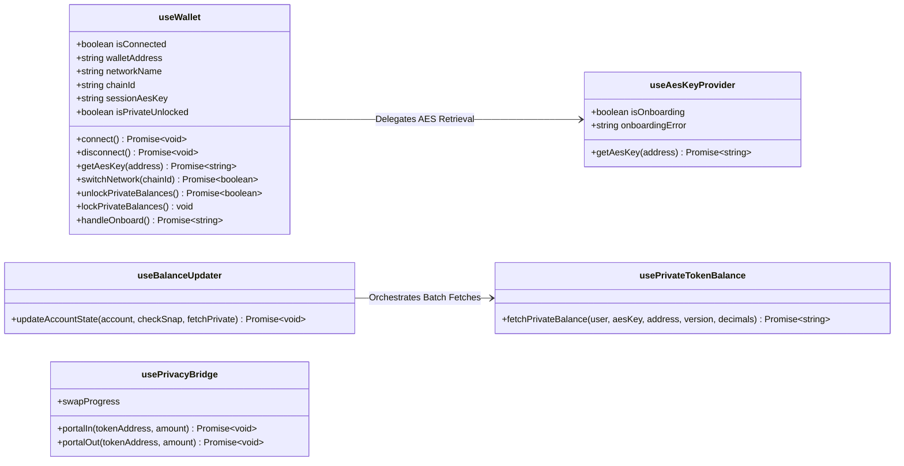

# @coti-io/coti-wallet-plugin

High-level TypeScript library for **Private Token (pToken) operations** on the COTI network. Provides React hooks, cryptographic utilities, multi-wallet support (RainbowKit + wagmi v2), and token detection for any EIP-1193 wallet.

## What It Does

This library sits between your React/wagmi application and the low-level COTI SDKs, handling:

- **AES Key Management** — Retrieves encryption keys via MetaMask Snap or the COTI Onboarding Contract (multi-wallet support via RainbowKit + wagmi v2)
- **Balance Decryption** — Fetches encrypted on-chain balances and decrypts them client-side
- **Encrypted Transfers** — Constructs IT (Input Text) payloads for confidential ERC20 transfers
- **Token Detection** — Classifies contracts as standard ERC20, confidential ERC20 (64/256-bit), ERC721, or ERC1155
- **Privacy Bridge** — Orchestrates Portal In (deposit) and Portal Out (withdraw) operations with fee estimation
- **Network Configuration** — COTI Mainnet and Testnet chain definitions ready for wagmi/viem

## Installation

```bash
npm install @coti-io/coti-wallet-plugin
```

### Peer Dependencies

```bash
npm install react ethers viem @coti-io/coti-sdk-typescript @metamask/providers @rainbow-me/rainbowkit wagmi @tanstack/react-query
```

## Plugin Hooks Architecture

Below is a high-level representation of the core React hooks exposed by this plugin, outlining their key state variables and methods.



## Quick Start

### Basic Setup (MetaMask only)

```tsx
import { configureCotiPlugin, PrivacyBridgeProvider } from '@coti-io/coti-wallet-plugin';

// Optional — configure before rendering (defaults work for mainnet)
configureCotiPlugin({
  snapId: 'npm:@coti-io/coti-snap',
  defaultNetworkId: '0x282b34', // COTI Mainnet (2632500)
});

function App() {
  return (
    <PrivacyBridgeProvider>
      <YourApp />
    </PrivacyBridgeProvider>
  );
}
```

### Multi-Wallet Setup (RainbowKit + wagmi)

```tsx
import { WagmiRainbowKitProvider, PrivacyBridgeProvider } from '@coti-io/coti-wallet-plugin';

function App() {
  return (
    <WagmiRainbowKitProvider walletConnectProjectId="your-project-id">
      <PrivacyBridgeProvider>
        <YourApp />
      </PrivacyBridgeProvider>
    </WagmiRainbowKitProvider>
  );
}
```

## API Reference

### Configuration

| Export | Description |
|--------|-------------|
| `configureCotiPlugin(config)` | Set Snap ID and default network before rendering |
| `getPluginConfig()` | Read current plugin configuration |
| `cotiMainnet` / `cotiTestnet` | Chain definitions for wagmi/viem |
| `COTI_MAINNET_CHAIN_ID` / `COTI_TESTNET_CHAIN_ID` | Chain ID constants |

> **Note on Constants:** `COTI_MAINNET_CHAIN_ID` and `COTI_TESTNET_CHAIN_ID` are static, unchanging constants (2632500 and 7082400 respectively) exported to help developers avoid "magic numbers" in code, improving readability and reducing typos in network-specific routing or `if` statements.

### React Hooks

#### Wallet (Unified)

`useWallet()` is the recommended entry point for all wallet operations. It composes the lower-level hooks internally and manages the full wallet + AES key lifecycle:

```tsx
import { useWallet } from '@coti-io/coti-wallet-plugin';

const wallet = useWallet();
```

**Connection**

| Property / Method | Type | Description |
|---|---|---|
| `isConnected` | `boolean` | Whether a wallet is currently connected |
| `walletAddress` | `string` | The connected wallet address |
| `connect()` | `() => Promise<void>` | Opens MetaMask connection flow (permissions + account) |
| `disconnect()` | `() => Promise<void>` | Revokes permissions, clears all state and caches |

**Network**

| Property / Method | Type | Description |
|---|---|---|
| `networkName` | `string` | Human-readable network name (e.g. "COTI Mainnet") |
| `chainId` | `string \| null` | Current chain ID as decimal string |
| `switchNetwork(chainId)` | `(hex: string) => Promise<boolean>` | Request wallet to switch chains (adds chain if missing) |
| `COTI_MAINNET_ID` | `string` | `"0x282b34"` |
| `COTI_TESTNET_ID` | `string` | `"0x6c11a0"` |

**AES Key Lifecycle**

| Property / Method | Type | Description |
|---|---|---|
| `sessionAesKey` | `string \| null` | Current AES key (React state only, never persisted) |
| `isPrivateUnlocked` | `boolean` | `true` when session key is set |
| `getAesKey(address)` | `(addr: string) => Promise<string \| null>` | Retrieve AES key (routes to Snap for MetaMask, or Onboarding Contract for others) |
| `unlockPrivateBalances()` | `() => Promise<boolean>` | Calls `getAesKey` for current address, sets session key |
| `lockPrivateBalances()` | `() => void` | Clears session key and snap cache |
| `clearKeyCache()` | `() => void` | Forces fresh retrieval on next unlock (without locking) |

**Snap (backward compat)**

| Property / Method | Type | Description |
|---|---|---|
| `isSnapInstalled()` | `() => Promise<boolean>` | Check if COTI Snap is installed (no dialogs) |
| `connectToSnap()` | `() => Promise<boolean>` | Request Snap permissions |
| `snapError` | `string \| null` | Current Snap error message |

**Onboarding & Detection**

| Property / Method | Type | Description |
|---|---|---|
| `handleOnboard()` | `() => Promise<string \| null>` | Manual onboarding flow (generate/recover AES key via SDK) |
| `metamaskDetected` | `boolean` | Whether `window.ethereum` was found |
| `showInstallModal` | `boolean` | Whether to show "Install MetaMask" modal |
| `setShowInstallModal(show)` | `(show: boolean) => void` | Control install modal visibility |

**Usage example:**

```tsx
function WalletButton() {
  const { isConnected, connect, disconnect, isPrivateUnlocked, unlockPrivateBalances } = useWallet();

  if (!isConnected) {
    return <button onClick={connect}>Connect Wallet</button>;
  }

  return (
    <div>
      {!isPrivateUnlocked && (
        <button onClick={unlockPrivateBalances}>Unlock Private Balances</button>
      )}
      <button onClick={disconnect}>Disconnect</button>
    </div>
  );
}
```

#### Key & Onboarding (Low-Level)

| Hook | Description |
|------|-------------|
| `useSnap()` | MetaMask Snap lifecycle — install check, connect, get AES key |
| `useMetamask()` | MetaMask connection, network switching, account detection |

> These are internal implementations composed by `useWallet`. Use them directly only if you need fine-grained control over the Snap or MetaMask connection flow.

#### Balance Management

| Hook | Description |
|------|-------------|
| `usePrivateTokenBalance()` | Unified hook to fetch and decrypt 64-bit or 256-bit confidential token balances |
| `useBalanceUpdater()` | Orchestrates public + private balance refresh cycles |

**`usePrivateTokenBalance()`**
Provides a unified interface to retrieve and decrypt confidential balances safely.

| Method | Type | Description |
|--------|------|-------------|
| `fetchPrivateBalance(...)` | `(userAddress: string, aesKey: string, contractAddress: string, version: 64 \| 256, decimals?: number) => Promise<string>` | Fetches and decrypts the balance. Pass `64` for legacy native p.COTI, or `256` for wrapped/bridged confidential tokens. Natively throws on AES key mismatch. |

**`useBalanceUpdater(props)`**
Advanced orchestrator typically used at the Provider level to manage global token states and batch-fetch the entire wallet portfolio in parallel.

*Configuration Props:*
Accepts an object comprising React state setters (`setWalletAddress`, `setIsConnected`, `setHasSnap`, `setPublicTokens`, `setPrivateTokens`, `setSessionAesKey`) and dependency injection for core functions (`checkNetwork`, `getAESKeyFromSnap`, `fetchPrivateBalance`).

*Returns:*
| Method | Type | Description |
|--------|------|-------------|
| `updateAccountState(...)` | `(account: string, checkSnap?: boolean, fetchPrivate?: boolean) => Promise<void>` | Triggers a parallelized refresh of all configured COTI/ERC20 and p.ERC20 token balances. |

#### Bridge Operations

| Hook | Description |
|------|-------------|
| `usePrivacyBridge()` | Full bridge orchestration — deposit, withdraw, allowance |
| `useBridgeData()` | On-chain bridge state (fees, limits, paused status) |
| `useBridgeStatus()` | Real-time bridge transaction status tracking |
| `estimateBridgeFee()` | On-chain fee estimation for bridge operations |

#### Network

| Hook | Description |
|------|-------------|
| `useNetworkEnforcer()` | Enforces COTI-only networks, prompts chain switch (MetaMask via `wallet_switchEthereumChain`, non-MetaMask via wagmi `useSwitchChain`) |

### Multi-Wallet Support

| Export | Description |
|--------|-------------|
| `WagmiRainbowKitProvider` | Provider wrapping wagmi + RainbowKit + React Query for multi-wallet connection |
| `wagmiConfig` | Pre-configured wagmi config with COTI chains for consuming apps |
| `useWalletType()` | Detects connected wallet type from wagmi's `connector.id` |
| `useAesKeyProvider(walletTypeInfo)` | Routes AES key retrieval to Snap (MetaMask) or onboard contract (others) |
| `OnboardModal` | Modal component for non-MetaMask wallet onboarding flow |
| `useConnectModal` | Re-export from `@rainbow-me/rainbowkit` for opening the wallet picker |

**Types:**
- `WalletTypeInfo` — `{ isMetaMaskWithSnap, walletType, connectorId }`
- `WalletType` — `'metamask' | 'coinbase' | 'walletconnect' | 'rainbow' | 'unknown'`
- `AesKeyProviderResult` — `{ getAesKey, isOnboarding, onboardingError }`
- `OnboardModalProps` — Props for the OnboardModal component

### Cryptographic Utilities

Pure functions with no I/O — suitable for use outside React.

```typescript
import {
  normalizeAesKey,
  validateAesKey,
  decryptBalance,
  decryptCtUint64,
  decryptCtUint256,
  formatDecryptedBalance,
  isInsaneDecryptedValue,
  buildItUint64,
  buildItUint256,
  deriveWallet,
  signDigest,
  buildItSignature,
  normalizeSignature,
} from '@coti-io/coti-wallet-plugin';
```

| Function | Description |
|----------|-------------|
| `normalizeAesKey(key)` | Strip `0x`, lowercase — returns canonical 32-char hex |
| `validateAesKey(key)` | Validate + normalize, throws on invalid input |
| `decryptBalance(ct, key, variant?)` | Unified decryption (auto-detects 64 vs 256-bit) |
| `decryptCtUint64(ct, key, opts?)` | Decrypt a single 64-bit ciphertext |
| `decryptCtUint256(ct, key, opts?)` | Decrypt a 256-bit ciphertext (4 segments) |
| `formatDecryptedBalance(value, decimals)` | Format bigint to human-readable decimal string |
| `isInsaneDecryptedValue(value, decimals?, threshold?)` | Sanity check for AES key mismatch |
| `buildItUint64(plaintext, key, wallet, contract, selector)` | Encrypt + sign for 64-bit contract calls |
| `buildItUint256(plaintext, key, wallet, contract, selector)` | Encrypt + sign for 256-bit contract calls |
| `deriveWallet(key, account, chainId)` | Deterministic wallet from AES key |
| `signDigest(privateKey, digest)` | Raw ECDSA signature (r, s, v) |
| `buildItSignature(signer, contract, selector, ct, key)` | COTI IT signature (65-byte hex) |
| `normalizeSignature(sig)` | Normalize v (27/28 → 0x00/0x01) |

### Token Detection

```typescript
import {
  detectTokenType,
  probeConfidentialVersion256,
  getERC20Metadata,
  getERC721Metadata,
  verifyERC721Ownership,
  getConfidentialTokenURI,
  getPublicTokenURI,
  resolveIpfsUri,
} from '@coti-io/coti-wallet-plugin';
```

| Function | Description |
|----------|-------------|
| `detectTokenType(address, provider)` | Classify a contract (ERC20, confidential, ERC721, etc.) |
| `probeConfidentialVersion256(address, provider)` | Check if token uses 256-bit encryption |
| `getERC20Metadata(address, provider)` | Fetch name, symbol, decimals (cached) |
| `getERC721Metadata(address, provider)` | Fetch NFT collection metadata |
| `verifyERC721Ownership(address, tokenId, owner, provider)` | Check NFT ownership |
| `getConfidentialTokenURI(address, tokenId, key, provider)` | Decrypt confidential NFT URI |
| `getPublicTokenURI(address, tokenId, provider)` | Fetch public NFT URI (IPFS resolved) |
| `resolveIpfsUri(uri, gateway?)` | Convert `ipfs://` to HTTP gateway URL |

### Network & Utilities

```typescript
import {
  getNetworkConfig,
  NETWORK_CONFIGS,
  truncateAddress,
  generateTokenAvatar,
  formatTokenBalanceDisplay,
} from '@coti-io/coti-wallet-plugin';
```

| Function | Description |
|----------|-------------|
| `getNetworkConfig(chainId)` | Get RPC URL, explorer, name for a COTI chain |
| `NETWORK_CONFIGS` | Record of all supported COTI networks |
| `truncateAddress(address, length?)` | `"0x1234...abcd"` style truncation |
| `generateTokenAvatar(symbol)` | Deterministic SVG avatar from token symbol |
| `formatTokenBalanceDisplay(balance)` | Format with thousand separators and notation |

### Type Definitions

```typescript
import type {
  CtUint64,
  CtUint256,
  ItUint64,
  ItUint256,
  TokenClassification,
  DetectionResult,
  ERC20Metadata,
  ERC721Metadata,
  NetworkConfig,
  DecryptionOptions,
  CotiPluginConfig,
  Token,
  BridgeData,
  BridgeStatus,
  FeeEstimate,
} from '@coti-io/coti-wallet-plugin';
```

## Usage Examples

### Fetch and Decrypt a Private Balance (React Hook)

```tsx
import { usePrivateTokenBalance } from '@coti-io/coti-wallet-plugin';

function PrivateBalanceViewer({ userAddress, aesKey, tokenAddress }) {
  const { fetchPrivateBalance } = usePrivateTokenBalance();

  const handleFetch = async () => {
    try {
      // Pass 64 for legacy native p.COTI, or 256 for bridged/confidential ERC20s (p.WETH, p.USDT, etc.)
      const balance = await fetchPrivateBalance(userAddress, aesKey, tokenAddress, 256, 18);
      console.log(`Decrypted Balance: ${balance}`);
    } catch (error) {
      // Automatically throws if the AES key mismatches the on-chain ciphertext
      console.error("Failed to decrypt:", error.message);
    }
  };

  return <button onClick={handleFetch}>Fetch Balance</button>;
}
```

### Decrypt a Raw Balance Ciphertext (Core Utility)

```typescript
import { decryptBalance, formatDecryptedBalance } from '@coti-io/coti-wallet-plugin';

const plaintext = decryptBalance(onChainCiphertext, aesKey, 64);
if (plaintext !== null) {
  const display = formatDecryptedBalance(plaintext, 18);
  console.log(`Balance: ${display} COTI`);
}
```

### Build an Encrypted Transfer

```typescript
import { buildItUint64, deriveWallet, normalizeAesKey } from '@coti-io/coti-wallet-plugin';

const wallet = deriveWallet(aesKey, userAddress, '2632500');
const it = buildItUint64(
  1000000000000000000n, // 1 token (18 decimals)
  aesKey,
  wallet,
  tokenContractAddress,
  '0xa9059cbb', // transfer(address,uint256) selector
);
// it.ciphertext and it.signature are ready for the contract call
```

### Detect Token Type

```typescript
import { detectTokenType, TokenClassification } from '@coti-io/coti-wallet-plugin';

const result = await detectTokenType(tokenAddress, provider);
if (result.classification === TokenClassification.ConfidentialERC20_256) {
  console.log('This is a 256-bit confidential token');
}
```

### Use the Privacy Bridge Hook

```tsx
import { usePrivacyBridge } from '@coti-io/coti-wallet-plugin';

function BridgeComponent() {
  const { portalIn, portalOut, swapProgress } = usePrivacyBridge();

  const handleDeposit = async () => {
    await portalIn(tokenAddress, amount);
  };

  return <button onClick={handleDeposit}>Deposit to Private</button>;
}
```

## Security

- **Memory-Only Keys** — AES keys live exclusively in React state. Never written to localStorage, sessionStorage, IndexedDB, or cookies.
- **Ephemeral by Design** — Keys are lost on page refresh. Users must re-authenticate, eliminating persistent attack surface.
- **Sanity Guards** — Decryption includes threshold checks to detect AES key mismatches before displaying garbage values.
- **No Network Transmission** — AES keys are never sent over the network. All decryption is client-side.
- **Connector Identity** — Wallet type detection uses wagmi's stable `connector.id`, not spoofable `window.ethereum.isMetaMask`.
- **AES Key Validation** — All retrieved keys are validated against `/^[0-9a-fA-F]{64}$/` before use.
- **Session Isolation** — `sessionAesKey` is automatically cleared on account change, disconnect, or manual lock.

## Supported Networks

| Network | Chain ID | RPC |
|---------|----------|-----|
| COTI Mainnet | 2632500 | https://mainnet.coti.io/rpc |
| COTI Testnet | 7082400 | https://testnet.coti.io/rpc |

## Build

```bash
npm run build    # Produces dist/index.js (CJS) + dist/index.mjs (ESM) + dist/index.d.ts
npm run lint     # TypeScript type check (tsc --noEmit)
npm run clean    # Remove dist/
```

## Documentation

- [Snap-to-Plugin Architecture](./docs/metamask_wallet_architecture.md) — Module design, data flow, correctness properties
- [Portal Wallet Requirements](./docs/portal_wallet_requirements.md) — Multi-wallet support design (RainbowKit/wagmi) — ✅ Implemented
- [Portal Wallet Architecture](./docs/portal_wallet_architecture.md) — Library architecture and security model — ✅ Implemented

## License

Apache-2.0
