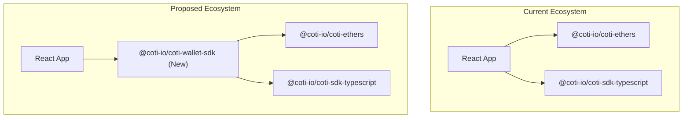
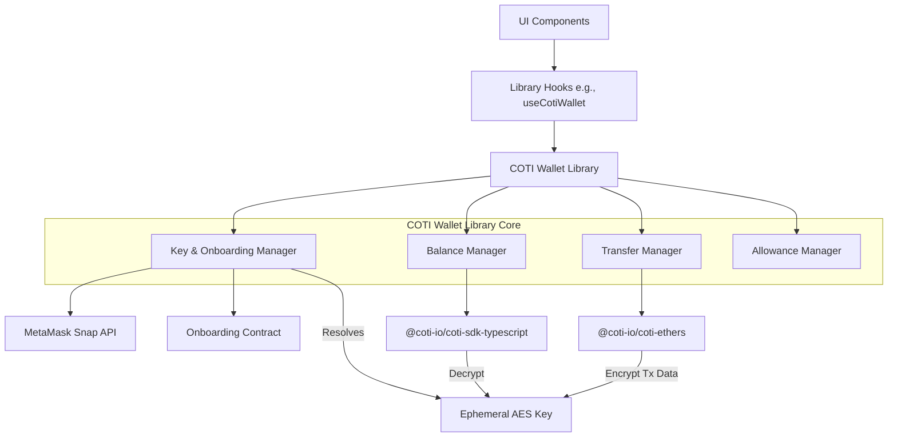
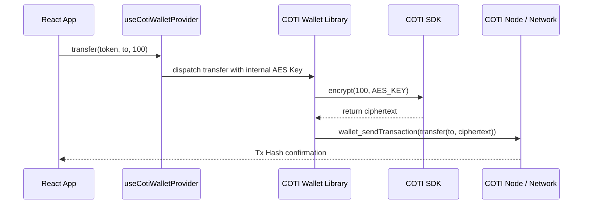
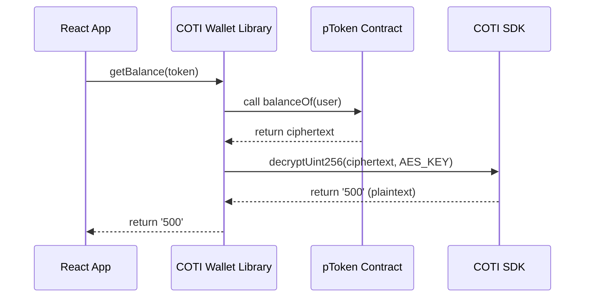

# Architecture Document: COTI Wallet Library

## 1. Overview

The current COTI ecosystem heavily relies on `@coti-io/coti-ethers` and `@coti-io/coti-sdk-typescript` for interacting with the COTI network. However, with the introduction of RainbowKit and multi-wallet support (as outlined in `walletdesign.md`), there is a distinct gap: the base libraries lack a unified, high-level abstraction for performing **Private Token (pToken) operations** (specifically transfers and decrypted balance retrieval) across different EIP-1193 wallets.

This document proposes the architecture for a new **COTI Wallet Library** (to be published as `@coti-io/coti-wallet-sdk`) to sit as a middleware between the application layer (React/wagmi context) and the low-level COTI SDKs.

## 2. Motivation & Goals

- **Missing Abstractions:** Currently, `@coti-io/coti-ethers` v1.0.5 and `@coti-io/coti-sdk-typescript` v1.0.6 require manual orchestration of AES keys, contract instantiations, block-scoping, and encryption (`CotiSDK.encryptUint256`) for every private transaction.
- **Multi-Wallet Compatibility:** pToken operations must seamlessly use the AES key whether it was derived via the MetaMask Snap or via the Onboarding Contract (for non-MetaMask wallets).
- **Goal:** Create an easy-to-use library that exports standard functions (`getBalance`, `transferPrivate`) while strictly adhering to the ephemeral AES key security rules defined in the RainbowKit Multi-Wallet design.

## 3. High-Level Architecture

The new library will function as a comprehensive "Facade" over standard Ethers.js contracts, actively encapsulating the AES key retrieval, onboarding flows, and COTI encryption/decryption mechanisms under the hood. It exposes ready-to-use hooks and classes.

## 4. Core Components

### 4.1. `Key & Onboarding Manager`

Instead of relying on external React contexts, the library embeds the onboarding logic directly, handling both the MetaMask Snap path and the generic EIP-1193 Onboarding Contract path.

- **`resolveAesKey(address, providerInfo)`**: Automatically determines whether to use `getAESKeyFromSnap` or `generateOrRecoverAes()` based on the connected wallet type.
- **`useCotiWalletProvider()`**: A React Hook exported by the library that internally utilizes the key manager to resolve, hold, and supply the ephemeral AES key to the operational modules.

### 4.2. `BalanceManager` (Read Operations)

Responsible for fetching ciphertext balances from EVM contracts and decrypting them client-side.

- **`getBalance(tokenAddress, ownerAddress)`**: 
  1. Calls `balanceOf()` on the ERC20-like pToken contract.
  2. Receives encrypted `uint256` ciphertext.
  3. Uses `CotiSDK.decryptUint256(ciphertext, this.aesKey)` to return the plaintext balance.

### 4.3. `TransferManager` (Write Operations)

Responsible for constructing secure, encrypted transfer payloads before prompting the user to sign via their Wagmi-connected wallet.

- **`transfer(tokenAddress, toAddress, plaintextAmount)`**:
  1. Retrieves the sender's AES key.
  2. Uses `CotiSDK.buildCiphertext` to encrypt the `plaintextAmount`.
  3. Estimates gas using the `coti-ethers` customized provider.
  4. Dispatches the `transfer(address, uint256 ciphertext)` call.

## 5. Security Integration

This library relies strictly on the `walletdesign.md` security constraints:
- **No Persistent Storage:** The library dynamically resolves the AES key via the `Key & Onboarding Manager`. It NEVER writes the key to `localStorage`, `sessionStorage`, `IndexedDB`, or cookies.
- **Ephemeral State:** The exported React Hooks (e.g., `useCotiWalletProvider`) maintain the resolved AES key exclusively in React's memory (state). If a user refreshes the page or changes their account, the key is immediately discarded from memory, and the user must re-authenticate.

## 6. Sequence Diagrams

### 6.1. Private Token Transfer Flow

### 6.2. Decrypted Balance Query

## 7. Future Considerations

- **Allowance & Approval**: Adding `approve` flows for smart contract interactions, requiring encryption of allowance limits.
- **Gas Abstraction**: Abstracting gas token (Native COTI) requirements vs the network fees.
- **Batch Operations**: Future versions of the library may support `multicall` to fetch encrypted balances of multiple pTokens simultaneously to save on RPC calls.
