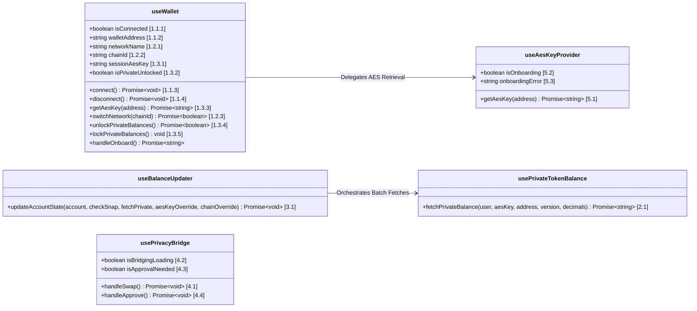

# @coti-io/coti-wallet-plugin

**Important:** This library is a **plugin for existing dApps and wallets**, not a standalone wallet application. It is designed to be injected into your existing React/wagmi stack to seamlessly enhance standard wallets with COTI network privacy capabilities.

High-level TypeScript library for **Private Token (pToken) operations** on the COTI network. Provides React hooks, multi-wallet support (via wagmi v2 and RainbowKit), and token detection for any EIP-1193 wallet. Although opiniated to  RainbowKit , wagmi classes can be adapted for use with other frameworks such as `ConnectKit` or `Privy`

## What It Does

### 🔌 A PLUGIN, NOT A WALLET

This package does not provide a wallet application. Instead, it acts as an **enhancement layer** over existing wallet providers that are compatible with EVM and COTI networks via RainbowKit, including:
- MetaMask
- Coinbase Wallet
- Trust Wallet
- Rainbow
- WalletConnect
- Safe
- Argent
- Ledger Live
- Brave Wallet
- Kraken Wallet
- Phantom (EVM)
- OKX Wallet
- Zerion
- TokenPocket
- Bitget Wallet
- Any injected EIP-1193 browser wallet

By hooking into standard EIP-1193 connections using **wagmi v2 and RainbowKit** as the underlying connection infrastructure, the plugin transparently adds COTI privacy features (AES key derivation, balance decryption, confidential transfers) to whatever wallet the user prefers to use.

### 🔑 ANY WALLET SUPPORT

Provides a complete React hook toolset for **any EIP-1193 wallet** (MetaMask, Coinbase, Rainbow, WalletConnect, and others) to connect to the COTI privacy layer using RainbowKit + wagmi v2 with on-chain contract onboarding.

**How it works:** When a user connects through RainbowKit, the plugin detects the wallet type via wagmi's stable `connector.id`. For MetaMask, it routes AES key retrieval through the COTI Snap. For all other wallets, it wraps the wallet's EIP-1193 provider into a `@coti-io/coti-ethers` BrowserProvider, obtains a signer, and calls `generateOrRecoverAes()` on the COTI Onboarding Contract — which prompts the user for a single signature to derive or recover their encryption key. This means any wallet that supports standard message signing can participate in COTI's privacy features without needing a custom extension or snap.

---

This library sits between your React/wagmi application and the low-level COTI SDKs, handling:

- **AES Key Management** — Retrieves encryption keys via MetaMask Snap or the COTI Onboarding Contract (multi-wallet support via RainbowKit + wagmi v2)
- **Balance Decryption** — Fetches encrypted on-chain balances and decrypts them client-side
- **Privacy Bridge** — Orchestrates Portal In (deposit) and Portal Out (withdraw) operations with fee estimation
- **Network Configuration** — COTI Mainnet and Testnet chain definitions ready for wagmi/viem

## Installation

```bash
npm install @coti-io/coti-wallet-plugin
```

### Peer Dependencies

```bash
npm install react ethers viem @coti-io/coti-sdk-typescript @metamask/providers @rainbow-me/rainbowkit wagmi @tanstack/react-query
```

## Plugin Architecture

Below is a high-level representation of the core React hooks exposed by this plugin, outlining their key state variables and methods. Numbers reference the [API Reference](#api-reference) sections below.



## API Reference

### Configuration


| Export                                            | Description                                      |
| ------------------------------------------------- | ------------------------------------------------ |
| `configureCotiPlugin(config)`                     | Set Snap ID and default network before rendering |
| `getPluginConfig()`                               | Read current plugin configuration                |
| `cotiMainnet` / `cotiTestnet`                     | Chain definitions for wagmi/viem                 |
| `COTI_MAINNET_CHAIN_ID` / `COTI_TESTNET_CHAIN_ID` | Decimal Chain ID constants                       |
| `COTI_MAINNET_RPC` / `COTI_TESTNET_RPC`           | Default RPC URLs                                 |

> **Note on Constants:** constants for mainnet and testnet are exported to help developers avoid "magic numbers" in code, improving readability and reducing typos in network-specific routing.

### React Hooks

The API is structured around several core React hooks that interact seamlessly.

#### 1. `useWallet()`

`useWallet()` is the recommended entry point for all wallet operations. It composes the lower-level hooks internally and manages the full wallet and AES key lifecycle.

**1.1. Connection**

- **1.1.1 `isConnected`** (`boolean`): Whether a wallet is currently connected.
- **1.1.2 `walletAddress`** (`string`): The connected wallet address.
- **1.1.3 `connect()`** (`() => Promise<void>`): Opens the wallet connection flow.
- **1.1.4 `disconnect()`** (`() => Promise<void>`): Revokes permissions and clears all state/caches.

**1.2. Network**

- **1.2.1 `networkName`** (`string`): Human-readable network name (e.g. "COTI Mainnet").
- **1.2.2 `chainId`** (`string | null`): Current chain ID as a decimal string.
- **1.2.3 `switchNetwork(chainId)`** (`(hex: string) => Promise<boolean>`): Requests the wallet to switch chains.
- **1.2.4 `COTI_MAINNET_ID`** (`string`): `"0x282b34"`
- **1.2.5 `COTI_TESTNET_ID`** (`string`): `"0x6c11a0"`
- **1.2.6 `SEPOLIA_ID`** (`string`): `"0xaa36a7"`

**1.3. AES Key Lifecycle**

- **1.3.1 `sessionAesKey`** (`string | null`): Current AES key (React state only, never persisted).
- **1.3.2 `isPrivateUnlocked`** (`boolean`): `true` when the session key is set.
- **1.3.3 `getAesKey(address)`** (`(addr: string) => Promise<string | null>`): Retrieves the AES key (routes to Snap for MetaMask, or Onboarding Contract for others).
- **1.3.4 `unlockPrivateBalances()`** (`() => Promise<boolean>`): Calls `getAesKey` for the current address and sets the session key.
- **1.3.5 `lockPrivateBalances()`** (`() => void`): Clears the session key and snap cache.
- **1.3.6 `clearKeyCache()`** (`() => void`): Forces a fresh retrieval on the next unlock.

#### 2. `usePrivateTokenBalance()`

Provides a unified interface to retrieve and decrypt private balances safely.

- **2.1 `fetchPrivateBalance(userAddress, aesKey, contractAddress, version, decimals?)`** (`Promise<string>`): Fetches and decrypts the balance. Pass `64` for legacy native p.COTI, or `256` for wrapped/bridged private ERC20s.

#### 3. `useBalanceUpdater(props)`

Advanced orchestrator typically used at the Provider level to manage global token states and batch-fetch the entire wallet portfolio in parallel.

- **3.1 `updateAccountState(account, checkSnap?, fetchPrivate?, aesKeyOverride?, chainOverride?)`** (`Promise<void>`): Triggers a parallelized refresh of all configured COTI/ERC20 and p.ERC20 token balances.

#### 4. `usePrivacyBridge()`

Full bridge orchestration — deposit, withdraw, allowance, and fee estimation.

- **4.1 `handleSwap(amount?, direction?, tokenIndex?, onProgress?)`** (`Promise<void>`): Unified method to execute a deposit ('to-private') or withdraw ('to-public').
- **4.2 `isBridgingLoading`** (`boolean`): Indicates a swap/bridge transaction is in progress.
- **4.3 `isApprovalNeeded`** (`boolean`): Indicates whether the selected swap requires an ERC20 allowance approval.
- **4.4 `handleApprove()`** (`Promise<void>`): Execute the approval allowance transaction for a bridge out operation.
- **4.5 `estimatedGasFee` / `portalFeeCoti`** (`string`): Active fee estimations for the selected bridge route.

#### 5. `useAesKeyProvider(walletTypeInfo)`

Routes AES key retrieval to Snap (MetaMask) or onboard contract (others).

- **5.1 `getAesKey(address)`** (`Promise<string>`): Resolves the AES key for the connected network/wallet type.
- **5.2 `isOnboarding`** (`boolean`): Indicates whether the onboarding process is actively running.
- **5.3 `onboardingError`** (`string | null`): Catches and exposes onboarding flow errors.

#### 6. Auxiliary Hooks & Utilities

- **6.1 `useBridgeData()`**: On-chain bridge state (fees, limits, paused status).
- **6.2 `useBridgeStatus()`**: Real-time bridge transaction status tracking.
- **6.3 `useNetworkEnforcer()`**: Enforces COTI-only networks, prompts chain switch.
- **6.4 `useSnap()` / `useMetamask()`**: Standalone hooks for legacy, pure-MetaMask implementations.
- **6.5 `formatTokenBalanceDisplay(balance)`**: Standardizes token display with thousand separators.

### Multi-Wallet Support


| Export                    | Description                                                      |
| ------------------------- | ---------------------------------------------------------------- |
| `WagmiRainbowKitProvider` | Provider wrapping wagmi + RainbowKit for multi-wallet connection |
| `wagmiConfig`             | Pre-configured wagmi config with COTI chains for consuming apps  |
| `useWalletType()`         | Detects connected wallet type from wagmi's`connector.id`         |
| `OnboardModal`            | Modal component for non-MetaMask wallet onboarding flow          |
| `useConnectModal`         | Re-export from`@rainbow-me/rainbowkit` to open the wallet picker |

### Extending Wallet Support

Wallet types are strictly typed and defined within [`src/hooks/useWalletType.ts`](src/hooks/useWalletType.ts). They determine how the AES key is dynamically retrieved (e.g. via Snap for MetaMask or the Onboarding Contract for others).

#### Currently Supported Wallet Types

| WalletType      | Connector IDs Matched                          | AES Key Strategy         |
| --------------- | ---------------------------------------------- | ------------------------ |
| `'metamask'`    | `metaMask`, `io.metamask`, `io.metamask.flask` | COTI Snap (if installed) |
| `'coinbase'`    | `coinbaseWalletSDK`, `*coinbase*`              | Onboarding Contract      |
| `'walletconnect'` | `walletConnect`, `*walletconnect*`           | Onboarding Contract      |
| `'rainbow'`     | `rainbow`, `*rainbow*`                         | Onboarding Contract      |
| `'phantom'`     | `phantom`, `*phantom*`                         | Onboarding Contract      |
| `'trust'`       | `trust-extension`, `trustWallet`, `*trust*`    | Onboarding Contract      |
| `'rabby'`       | `rabby`, `*rabby*`                             | Onboarding Contract      |
| `'ledger'`      | `ledger`, `*ledger*`                           | Onboarding Contract      |
| `'unknown'`     | Any unrecognized connector ID                  | Onboarding Contract      |

> Patterns with `*` indicate case-insensitive partial matching as a fallback (e.g. `*metamask*` matches `io.metamask.flask`).

#### How Wallet Detection Works

1. When a user connects via RainbowKit, wagmi exposes a stable `connector.id` (e.g. `"io.metamask.flask"`, `"coinbaseWalletSDK"`).
2. `mapConnectorIdToWalletType(connectorId)` first attempts an **exact match** against the `CONNECTOR_ID_TO_WALLET_TYPE` map.
3. If no exact match is found, it performs **case-insensitive partial matching** (e.g. any ID containing `"metamask"` resolves to `'metamask'`).
4. If the resolved type is `'metamask'`, an async check via `wallet_getSnaps` determines whether the COTI Snap is installed, setting `isMetaMaskWithSnap`.
5. The `useAesKeyProvider` hook uses `isMetaMaskWithSnap` to route: Snap flow for MetaMask, Onboarding Contract for everything else.

#### Adding a New Wallet

To add support for a newly recognized `connector.id` or new wallet definition:

1. **Add to Type:** Add the new wallet identifier to the `WalletType` union in `src/hooks/useWalletType.ts` (e.g., `'okx'`).
2. **Map Connector ID:** Add wagmi's `connector.id` for that wallet to the `CONNECTOR_ID_TO_WALLET_TYPE` constant (e.g., `'com.okex.wallet': 'okx'`).
3. **Add Partial Match (optional):** If the wallet has multiple connector ID variants, add a partial match case in `mapConnectorIdToWalletType`.
4. **Verify Fallback:** If a connector ID isn't mapped, it automatically falls back to `'unknown'`. The `'unknown'` type uses the standard EIP-1193 Onboarding Contract fallback method by default, meaning most wallets will "just work" even if not explicitly mapped here.

```typescript
// Example: Adding OKX Wallet support
export type WalletType = 'metamask' | 'coinbase' | ... | 'okx' | 'unknown';

const CONNECTOR_ID_TO_WALLET_TYPE: Record<string, WalletType> = {
  ...
  'com.okex.wallet': 'okx',
  okx: 'okx',
};
```

> **Note:** Adding a new wallet type is only necessary if you need to implement wallet-specific behavior. For standard EIP-1193 wallets that use the Onboarding Contract flow, no changes are needed — they work automatically via the `'unknown'` fallback.

## Usage Examples


### Basic Setup (MetaMask only)

```tsx
import { configureCotiPlugin, PrivacyBridgeProvider } from '@coti-io/coti-wallet-plugin';

// Optional — configure before rendering (defaults work for mainnet)
configureCotiPlugin({
  snapId: 'npm:@coti-io/coti-snap',
  defaultNetworkId: '0x282b34', // COTI Mainnet (2632500)
});

function App() {
  return (
    <PrivacyBridgeProvider>
      <YourApp />
    </PrivacyBridgeProvider>
  );
}
```

### Any Wallet Setup (RainbowKit + wagmi)

```tsx
import { WagmiRainbowKitProvider, PrivacyBridgeProvider } from '@coti-io/coti-wallet-plugin';

function App() {
  return (
    <WagmiRainbowKitProvider walletConnectProjectId="your-project-id">
      <PrivacyBridgeProvider>
        <YourApp />
      </PrivacyBridgeProvider>
    </WagmiRainbowKitProvider>
  );
}
```


### Fetch and Decrypt a Private Balance (React Hook)

```tsx
import { usePrivateTokenBalance } from '@coti-io/coti-wallet-plugin';

function PrivateBalanceViewer({ userAddress, aesKey, tokenAddress }) {
  const { fetchPrivateBalance } = usePrivateTokenBalance();

  const handleFetch = async () => {
    try {
      // Pass 64 for legacy native p.COTI, or 256 for bridged/private ERC20s
      const balance = await fetchPrivateBalance(userAddress, aesKey, tokenAddress, 256, 18);
      console.log(`Decrypted Balance: ${balance}`);
    } catch (error) {
      console.error("Failed to decrypt:", error.message);
    }
  };

  return <button onClick={handleFetch}>Fetch Balance</button>;
}
```

### Use the Privacy Bridge Hook

```tsx
import { usePrivacyBridge } from '@coti-io/coti-wallet-plugin';

function BridgeComponent() {
  const { handleSwap, isBridgingLoading } = usePrivacyBridge();

  const handleDeposit = async () => {
    // 100 tokens, sending to private side, token array index 0
    await handleSwap('100', 'to-private', 0);
  };

  return (
    <button onClick={handleDeposit} disabled={isBridgingLoading}>
      {isBridgingLoading ? 'Depositing...' : 'Deposit to Private'}
    </button>
  );
}
```

## Security

- **Memory-Only Keys** — AES keys live exclusively in React state. Never written to localStorage, sessionStorage, IndexedDB, or cookies.
- **Ephemeral by Design** — Keys are lost on page refresh. Users must re-authenticate, eliminating persistent attack surface.
- **Sanity Guards** — Decryption includes threshold checks to detect AES key mismatches before displaying garbage values.
- **No Network Transmission** — AES keys are never sent over the network. All decryption is client-side.
- **Connector Identity** — Wallet type detection uses wagmi's stable `connector.id`, not spoofable `window.ethereum.isMetaMask`.
- **AES Key Validation** — All retrieved keys are validated against `/^[0-9a-fA-F]{64}$/` before use.
- **Session Isolation** — `sessionAesKey` is automatically cleared on account change, disconnect, or manual lock.

## Supported Networks


| Network      | Chain ID | RPC                         |
| ------------ | -------- | --------------------------- |
| COTI Mainnet | 2632500  | https://mainnet.coti.io/rpc |
| COTI Testnet | 7082400  | https://testnet.coti.io/rpc |

## Build

```bash
npm run build    # Produces dist/index.js (CJS) + dist/index.mjs (ESM) + dist/index.d.ts
npm run lint     # TypeScript type check (tsc --noEmit)
npm run clean    # Remove dist/
```

## Documentation

- [Snap-to-Plugin Architecture](./docs/metamask_wallet_architecture.md) — Module design, data flow, correctness properties
- [Portal Wallet Requirements](./docs/portal_wallet_requirements.md) — Multi-wallet support design (RainbowKit/wagmi)
- [Portal Wallet Architecture](./docs/portal_wallet_architecture.md) — Library architecture and security model

## License

Apache-2.0
