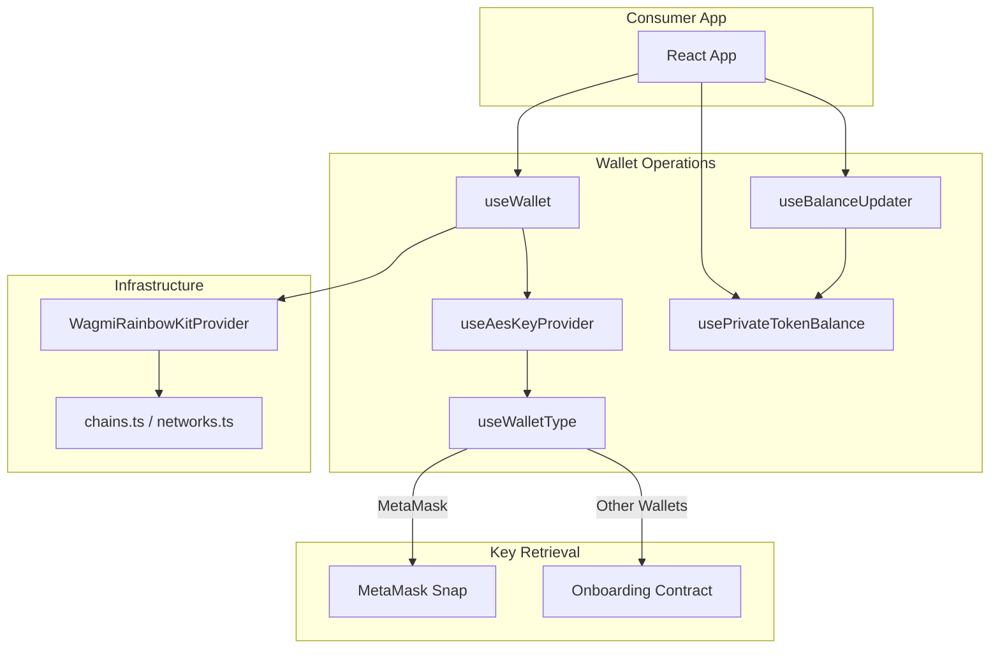
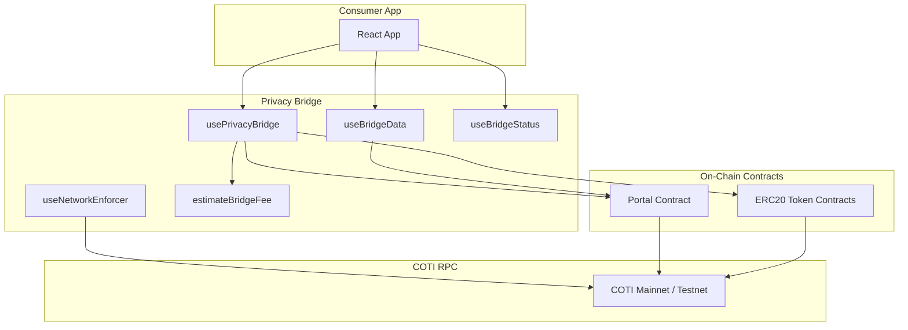
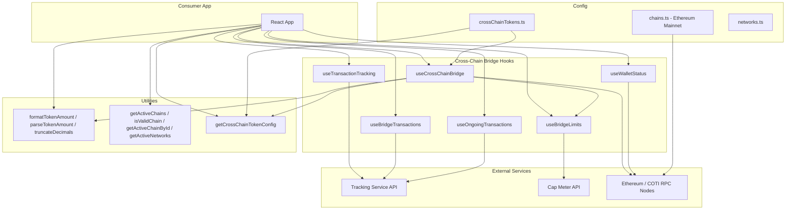

# @coti-io/coti-wallet-plugin

**Important:** This library is a **plugin for existing dApps and wallets**, not a standalone wallet application. It is designed to be injected into your existing React/wagmi stack to seamlessly enhance standard wallets with COTI network privacy capabilities.

 Provides React hooks, multi-wallet support (via wagmi v2 and RainbowKit), and token detection for any EIP-1193 wallet. Although opiniated to  RainbowKit , wagmi classes can be adapted for use with other frameworks such as `ConnectKit` or `Privy`

## What It Does

### A PLUGIN, NOT A WALLET

This package does not provide a wallet application. Instead, it acts as an **enhancement layer** over existing wallet providers that are compatible with EVM and COTI networks via RainbowKit, including:
- MetaMask
- Coinbase Wallet
- Trust Wallet
- Rainbow
- WalletConnect
- Safe
- Argent
- Ledger Live
- Brave Wallet
- Kraken Wallet
- Phantom (EVM)
- OKX Wallet
- Zerion
- TokenPocket
- Bitget Wallet
- Any injected EIP-1193 browser wallet

By hooking into standard EIP-1193 connections using **wagmi v2 and RainbowKit** as the underlying connection infrastructure, the plugin transparently adds COTI privacy features (AES key derivation, balance decryption, confidential transfers) to whatever wallet the user prefers to use.

### ANY WALLET SUPPORT

Provides a complete React hook toolset for **any EIP-1193 wallet** (MetaMask, Coinbase, Rainbow, WalletConnect, and others) to connect to the COTI privacy layer using RainbowKit + wagmi v2 with on-chain contract onboarding.

**How it works:** When a user connects through RainbowKit, the plugin detects the wallet type via wagmi's stable `connector.id`. For MetaMask, it routes AES key retrieval through the COTI Snap. For all other wallets, it wraps the wallet's EIP-1193 provider into a `@coti-io/coti-ethers` BrowserProvider, obtains a signer, and calls `generateOrRecoverAes()` on the COTI Onboarding Contract — which prompts the user for a single signature to derive or recover their encryption key. This means any wallet that supports standard message signing can participate in COTI's privacy features without needing a custom extension or snap.

This library sits between your React/wagmi application and the low-level COTI SDKs, handling:

- **AES Key Management** — Retrieves encryption keys via MetaMask Snap or the COTI Onboarding Contract (multi-wallet support via RainbowKit + wagmi v2)
- **Balance Decryption** — Fetches encrypted on-chain balances and decrypts them client-side
- **Privacy Bridge** — Orchestrates Portal In (deposit) and Portal Out (withdraw) operations with fee estimation
- **Cross-Chain Bridge** — Transfers tokens between COTI and Ethereum networks (native and ERC20) with transaction tracking, limits management, and ongoing transaction monitoring
- **Network Configuration** — COTI Mainnet, Testnet, and Ethereum Mainnet chain definitions ready for wagmi/viem

## Installation

```bash
npm install @coti-io/coti-wallet-plugin
```

## Peer Dependencies

```bash
npm install react ethers viem @coti-io/coti-sdk-typescript @metamask/providers @rainbow-me/rainbowkit wagmi @tanstack/react-query
```

## Build

```bash
npm run build    # Produces dist/index.js (CJS) + dist/index.mjs (ESM) + dist/index.d.ts
npm run lint     # TypeScript type check (tsc --noEmit)
npm run test     # Run test suite (vitest)
npm run clean    # Remove dist/
```


### Multi-Wallet Support

Wallet types are strictly typed and defined within [`src/hooks/useWalletType.ts`](src/hooks/useWalletType.ts). They determine how the AES key is dynamically retrieved (e.g. via Snap for MetaMask or the Onboarding Contract for others).

#### Currently Supported Wallet Types

| WalletType      | Connector IDs Matched                          | AES Key Strategy         |
| --------------- | ---------------------------------------------- | ------------------------ |
| `'metamask'`    | `metaMask`, `io.metamask`, `io.metamask.flask` | COTI Snap (if installed) |
| `'coinbase'`    | `coinbaseWalletSDK`, `*coinbase*`              | Onboarding Contract      |
| `'walletconnect'` | `walletConnect`, `*walletconnect*`           | Onboarding Contract      |
| `'rainbow'`     | `rainbow`, `*rainbow*`                         | Onboarding Contract      |
| `'phantom'`     | `phantom`, `*phantom*`                         | Onboarding Contract      |
| `'trust'`       | `trust-extension`, `trustWallet`, `*trust*`    | Onboarding Contract      |
| `'rabby'`       | `rabby`, `*rabby*`                             | Onboarding Contract      |
| `'ledger'`      | `ledger`, `*ledger*`                           | Onboarding Contract      |
| `'unknown'`     | Any unrecognized connector ID                  | Onboarding Contract      |

> Patterns with `*` indicate case-insensitive partial matching as a fallback (e.g. `*metamask*` matches `io.metamask.flask`).

#### How Wallet Detection Works

1. When a user connects via RainbowKit, wagmi exposes a stable `connector.id` (e.g. `"io.metamask.flask"`, `"coinbaseWalletSDK"`).
2. `mapConnectorIdToWalletType(connectorId)` first attempts an **exact match** against the `CONNECTOR_ID_TO_WALLET_TYPE` map.
3. If no exact match is found, it performs **case-insensitive partial matching** (e.g. any ID containing `"metamask"` resolves to `'metamask'`).
4. If the resolved type is `'metamask'`, an async check via `wallet_getSnaps` determines whether the COTI Snap is installed, setting `isMetaMaskWithSnap`.
5. The `useAesKeyProvider` hook uses `isMetaMaskWithSnap` to route: Snap flow for MetaMask, Onboarding Contract for everything else.

#### Adding a New Wallet

To add support for a newly recognized `connector.id` or new wallet definition:

1. **Add to Type:** Add the new wallet identifier to the `WalletType` union in `src/hooks/useWalletType.ts` (e.g., `'okx'`).
2. **Map Connector ID:** Add wagmi's `connector.id` for that wallet to the `CONNECTOR_ID_TO_WALLET_TYPE` constant (e.g., `'com.okex.wallet': 'okx'`).
3. **Add Partial Match (optional):** If the wallet has multiple connector ID variants, add a partial match case in `mapConnectorIdToWalletType`.
4. **Verify Fallback:** If a connector ID isn't mapped, it automatically falls back to `'unknown'`. The `'unknown'` type uses the standard EIP-1193 Onboarding Contract fallback method by default, meaning most wallets will "just work" even if not explicitly mapped here.

```typescript
// Example: Adding OKX Wallet support
export type WalletType = 'metamask' | 'coinbase' | ... | 'okx' | 'unknown';

const CONNECTOR_ID_TO_WALLET_TYPE: Record<string, WalletType> = {
  ...
  'com.okex.wallet': 'okx',
  okx: 'okx',
};
```

> **Note:** Adding a new wallet type is only necessary if you need to implement wallet-specific behavior. For standard EIP-1193 wallets that use the Onboarding Contract flow, no changes are needed — they work automatically via the `'unknown'` fallback.


## COTI WALLET PLUGIN ARCHITECTURE

### Wallet Operations

Connection, AES key management, and balance decryption hooks.



### Private Portal Architecture

Portal In (deposit) and Portal Out (withdraw) operations between public and private token states on the COTI chain.



### Cross-Chain Bridge Architecture

Token transfers between COTI and Ethereum networks via native transfers and ERC20 `transfer()` calls to designated bridge recipient addresses.



## API Reference

### Wallet Operations

#### 1. `useWallet()`

`useWallet()` is the recommended entry point for all wallet operations. It composes the lower-level hooks internally and manages the full wallet and AES key lifecycle.

**1.1. Connection**

- **1.1.1 `isConnected`** (`boolean`): Whether a wallet is currently connected.
- **1.1.2 `walletAddress`** (`string`): The connected wallet address.
- **1.1.3 `connect()`** (`() => Promise<void>`): Opens the wallet connection flow.
- **1.1.4 `disconnect()`** (`() => Promise<void>`): Revokes permissions and clears all state/caches.

**1.2. Network**

- **1.2.1 `networkName`** (`string`): Human-readable network name (e.g. "COTI Mainnet").
- **1.2.2 `chainId`** (`string | null`): Current chain ID as a decimal string.
- **1.2.3 `switchNetwork(chainId)`** (`(hex: string) => Promise<boolean>`): Requests the wallet to switch chains.
- **1.2.4 `COTI_MAINNET_ID`** (`string`): `"0x282b34"`
- **1.2.5 `COTI_TESTNET_ID`** (`string`): `"0x6c11a0"`
- **1.2.6 `SEPOLIA_ID`** (`string`): `"0xaa36a7"`

**1.3. AES Key Lifecycle**

- **1.3.1 `sessionAesKey`** (`string | null`): Current AES key (React state only, never persisted).
- **1.3.2 `isPrivateUnlocked`** (`boolean`): `true` when the session key is set.
- **1.3.3 `getAesKey(address)`** (`(addr: string) => Promise<string | null>`): Retrieves the AES key (routes to Snap for MetaMask, or Onboarding Contract for others).
- **1.3.4 `unlockPrivateBalances()`** (`() => Promise<boolean>`): Calls `getAesKey` for the current address and sets the session key.
- **1.3.5 `lockPrivateBalances()`** (`() => void`): Clears the session key and snap cache.
- **1.3.6 `clearKeyCache()`** (`() => void`): Forces a fresh retrieval on the next unlock.

#### 2. `usePrivateTokenBalance()`

Provides a unified interface to retrieve and decrypt private balances safely.

- **2.1 `fetchPrivateBalance(userAddress, aesKey, contractAddress, version, decimals?)`** (`Promise<string>`): Fetches and decrypts the balance. Pass `64` for legacy native p.COTI, or `256` for wrapped/bridged private ERC20s.

#### 3. `useBalanceUpdater(props)`

Advanced orchestrator typically used at the Provider level to manage global token states and batch-fetch the entire wallet portfolio in parallel.

- **3.1 `updateAccountState(account, checkSnap?, fetchPrivate?, aesKeyOverride?, chainOverride?)`** (`Promise<void>`): Triggers a parallelized refresh of all configured COTI/ERC20 and p.ERC20 token balances.

### Privacy Bridge Hooks

#### 4. `usePrivacyBridge()`

Full bridge orchestration — deposit, withdraw, allowance, and fee estimation.

- **4.1 `handleSwap(amount?, direction?, tokenIndex?, onProgress?)`** (`Promise<void>`): Unified method to execute a deposit ('to-private') or withdraw ('to-public').
- **4.2 `isBridgingLoading`** (`boolean`): Indicates a swap/bridge transaction is in progress.
- **4.3 `isApprovalNeeded`** (`boolean`): Indicates whether the selected swap requires an ERC20 allowance approval.
- **4.4 `handleApprove()`** (`Promise<void>`): Execute the approval allowance transaction for a bridge out operation.
- **4.5 `estimatedGasFee` / `portalFeeCoti`** (`string`): Active fee estimations for the selected bridge route.

#### 5. `useAesKeyProvider(walletTypeInfo)`

Routes AES key retrieval to Snap (MetaMask) or onboard contract (others).

- **5.1 `getAesKey(address)`** (`Promise<string>`): Resolves the AES key for the connected network/wallet type.
- **5.2 `isOnboarding`** (`boolean`): Indicates whether the onboarding process is actively running.
- **5.3 `onboardingError`** (`string | null`): Catches and exposes onboarding flow errors.

#### 6. Auxiliary Hooks & Utilities

- **6.1 `useBridgeData()`**: On-chain bridge state (fees, limits, paused status).
- **6.2 `useBridgeStatus()`**: Real-time bridge transaction status tracking.
- **6.3 `useNetworkEnforcer()`**: Enforces COTI-only networks, prompts chain switch.
- **6.4 `useSnap()` / `useMetamask()`**: Standalone hooks for legacy, pure-MetaMask implementations.
- **6.5 `formatTokenBalanceDisplay(balance)`**: Standardizes token display with thousand separators.

### Cross-Chain Bridge Hooks

These hooks enable token transfers between COTI and Ethereum networks. They are distinct from the privacy bridge hooks which handle public ↔ private token movement on the same COTI chain.

#### 7.1 `useCrossChainBridge()`

Executes cross-chain bridge transactions with pre-validation (limits, minimums, balance checks).

- **`bridgeNative(amount, tokenId)`** (`(amount: bigint, tokenId: string) => Promise<void>`): Sends native token to the configured bridge recipient address.
- **`bridgeERC20(amount, tokenId, tokenAddress)`** (`(amount: bigint, tokenId: string, tokenAddress: \`0x\${string}\`) => Promise<void>`): Calls ERC20 `transfer()` to the configured bridge recipient.
- **`isLoading`** (`boolean`): Whether a bridge transaction is in progress.
- **`error`** (`BridgeError | null`): Typed error with codes: `DAILY_LIMIT_EXCEEDED`, `BELOW_MINIMUM`, `INSUFFICIENT_BALANCE`, `TRANSACTION_FAILED`, `UNSUPPORTED_TOKEN`.
- **`txHash`** (`string | null`): Transaction hash after successful submission.

#### 7.2 `useTransactionTracking(txHash, sourceNetworkId, destinationNetworkId)`

Polls the tracking service for real-time transaction progress.

- **`currentStep`** (`number | null`): Current stage (COTI-source: 4 steps, Ethereum-source: 3 steps).
- **`destinationHash`** (`string | null`): Destination chain tx hash when completed.
- **`failureReason`** (`string | null`): Reason if the transaction failed.
- **`failedStep`** (`number | null`): Step number where failure occurred.
- **`fee`** (`string | null`): Bridge fee from the tracking service.
- **`isLoading`** / **`error`**: Standard loading and error states.

#### 7.3 `useBridgeTransactions(walletAddress, pageSize, pageNumber)`

Fetches paginated transaction history with 30-second caching.

- **`transactions`** (`BridgeTransaction[]`): Enriched transaction records with current step, completion status, and destination hash.
- **`totalCount`** (`number`): Total number of transactions for pagination.
- **`isLoading`** / **`error`**: Standard loading and error states.

#### 7.4 `useBridgeLimits(walletAddress, tokenId)`

Polls the Cap Meter API for user and global daily bridge limits (default: every 30 seconds).

- **`userDailyLimit`** (`string`): User's remaining daily limit in human-readable token units.
- **`globalDailyLimit`** (`string`): Global remaining daily limit.
- **`isLoading`** / **`error`**: Standard loading and error states.

#### 7.5 `useWalletStatus()`

Reports wallet chain validity for cross-chain bridge operations and provides network switching.

- **`isConnected`** (`boolean`): Connection status.
- **`address`** (`string`): Connected address or empty string.
- **`chainId`** (`number | null`): Current chain ID.
- **`isValidChain`** (`boolean`): Whether the current chain is valid for bridge operations.
- **`switchChain(chainId)`** (`(chainId: number) => Promise<void>`): Switches to a valid chain.
- **`switchError`** (`string | null`): Error from last failed switch attempt.
- **`disconnect()`** (`() => void`): Disconnects the wallet.

#### 7.6 `useOngoingTransactions()`

Monitors all in-progress bridge operations via a module-level registry that persists across component mount/unmount.

- **`transactions`** (`OngoingTransaction[]`): All in-progress transactions with current step, destination hash, and failure info.

Use `registerTransaction({ tokenId, sourceChainId, destinationChainId, txHash })` to add a transaction to the registry.

#### Cross-Chain Utility Functions

| Function | Signature | Description |
| --- | --- | --- |
| `formatTokenAmount` | `(value: bigint, decimals: number) => string` | Formats bigint to decimal string without trailing zeros |
| `parseTokenAmount` | `(value: string, decimals: number) => bigint` | Parses decimal string to bigint (throws on invalid input) |
| `truncateDecimals` | `(value: string, maxDecimals: number) => string` | Truncates without rounding |
| `getActiveChains` | `(connectedChainId?) => ChainPair[]` | Returns valid chain pairs for the current environment |
| `isValidChain` | `(chainId, connectedChainId?) => boolean` | Checks if chain is valid for bridge operations |
| `getActiveChainById` | `(chainId, connectedChainId?) => ChainConfig \| undefined` | Returns chain config for a specific chain |
| `getActiveNetworks` | `(connectedChainId?) => ChainConfig[]` | Returns all active chain configs |
| `getCrossChainTokenConfig` | `(tokenId, chainId) => CrossChainTokenConfig \| undefined` | Returns token configuration for bridge operations |


## Usage Examples

### Example App

A complete working example is available in the [`examples/`](./examples/) directory. It demonstrates wallet connection, public ERC20 balance reading, and private balance decryption using tokens from the [COTI Token List](https://github.com/coti-io/coti-token-list).

```bash
# Build the plugin first
npm run build

# Run the example
cd examples
cp .env.example .env   # Add your WalletConnect project ID
npm install
npm run dev            # Opens at http://localhost:5173
```


### Basic Setup (MetaMask only)

```tsx
import { configureCotiPlugin, PrivacyBridgeProvider } from '@coti-io/coti-wallet-plugin';

// Optional — configure before rendering (defaults work for mainnet)
configureCotiPlugin({
  snapId: 'npm:@coti-io/coti-snap',
  defaultNetworkId: '0x282b34', // COTI Mainnet (2632500)
});

function App() {
  return (
    <PrivacyBridgeProvider>
      <YourApp />
    </PrivacyBridgeProvider>
  );
}
```

### Any Wallet Setup (RainbowKit + wagmi)

```tsx
import { WagmiRainbowKitProvider, PrivacyBridgeProvider } from '@coti-io/coti-wallet-plugin';

function App() {
  return (
    <WagmiRainbowKitProvider walletConnectProjectId="your-project-id">
      <PrivacyBridgeProvider>
        <YourApp />
      </PrivacyBridgeProvider>
    </WagmiRainbowKitProvider>
  );
}
```


### Fetch and Decrypt a Private Balance (React Hook)

```tsx
import { usePrivateTokenBalance } from '@coti-io/coti-wallet-plugin';

function PrivateBalanceViewer({ userAddress, aesKey, tokenAddress }) {
  const { fetchPrivateBalance } = usePrivateTokenBalance();

  const handleFetch = async () => {
    try {
      // Pass 64 for legacy native p.COTI, or 256 for bridged/private ERC20s
      const balance = await fetchPrivateBalance(userAddress, aesKey, tokenAddress, 256, 18);
      console.log(`Decrypted Balance: ${balance}`);
    } catch (error) {
      console.error("Failed to decrypt:", error.message);
    }
  };

  return <button onClick={handleFetch}>Fetch Balance</button>;
}
```

### Use the Privacy Bridge Hook

```tsx
import { usePrivacyBridge } from '@coti-io/coti-wallet-plugin';

function BridgeComponent() {
  const { handleSwap, isBridgingLoading } = usePrivacyBridge();

  const handleDeposit = async () => {
    // 100 tokens, sending to private side, token array index 0
    await handleSwap('100', 'to-private', 0);
  };

  return (
    <button onClick={handleDeposit} disabled={isBridgingLoading}>
      {isBridgingLoading ? 'Depositing...' : 'Deposit to Private'}
    </button>
  );
}
```

### Cross-Chain Bridge (COTI ↔ Ethereum)

```tsx
import {
  useCrossChainBridge,
  useTransactionTracking,
  useWalletStatus,
  registerTransaction,
  parseTokenAmount,
} from '@coti-io/coti-wallet-plugin';

function CrossChainBridge() {
  const { bridgeNative, bridgeERC20, isLoading, error, txHash } = useCrossChainBridge();
  const { isValidChain, switchChain } = useWalletStatus();
  const tracking = useTransactionTracking(txHash, 7082400, 11155111);

  const handleBridgeNative = async () => {
    if (!isValidChain) {
      await switchChain(7082400); // Switch to COTI Testnet
    }

    const amount = parseTokenAmount('10', 18); // 10 COTI
    await bridgeNative(amount, 'COTI');

    // Register for ongoing monitoring
    if (txHash) {
      registerTransaction({
        tokenId: 'COTI',
        sourceChainId: 7082400,
        destinationChainId: 11155111,
        txHash,
      });
    }
  };

  return (
    <div>
      <button onClick={handleBridgeNative} disabled={isLoading}>
        {isLoading ? 'Bridging...' : 'Bridge 10 COTI to Ethereum'}
      </button>
      {error && <p>Error: {error.message}</p>}
      {tracking.currentStep && <p>Step {tracking.currentStep} of 4</p>}
      {tracking.destinationHash && <p>Done! Dest tx: {tracking.destinationHash}</p>}
    </div>
  );
}
```

## Security

- **Memory-Only Keys** — AES keys live exclusively in React state and a module-level singleton cache. Never written to localStorage, sessionStorage, IndexedDB, or cookies.
- **Ephemeral by Design** — Keys are lost on page refresh. Users must re-authenticate, eliminating persistent attack surface.
- **Singleton Cache** — The internal AES key cache (`globalAESKeyCache`) is a module-scoped variable shared across all hook instances within a single browser tab. This is intentional for performance (avoids re-prompting the user on every component mount) but means the plugin is designed exclusively for **browser SPA environments**. It is not compatible with SSR or React Server Components.
- **Sanity Guards** — Decryption includes threshold checks to detect AES key mismatches before displaying garbage values.
- **No Network Transmission** — AES keys are never sent over the network. All decryption is client-side.
- **Connector Identity** — Wallet type detection uses wagmi's stable `connector.id`, not spoofable `window.ethereum.isMetaMask`.
- **Session Isolation** — `sessionAesKey` is automatically cleared on account change, disconnect, or manual lock. The singleton cache is also cleared on these events via `clearSnapCache()`.

## Supported Networks


| Network           | Chain ID   | RPC                                          |
| ----------------- | ---------- | -------------------------------------------- |
| COTI Mainnet      | 2632500    | https://mainnet.coti.io/rpc                  |
| COTI Testnet      | 7082400    | https://testnet.coti.io/rpc                  |
| Ethereum Mainnet  | 1          | https://eth.llamarpc.com                     |
| Ethereum Sepolia  | 11155111   | https://ethereum-sepolia-rpc.publicnode.com   |

### Cross-Chain Bridge Chain Pairs

| Environment | COTI Network         | Ethereum Network     |
| ----------- | -------------------- | -------------------- |
| Testnet     | COTI Testnet (7082400) | Sepolia (11155111) |
| Mainnet     | COTI Mainnet (2632500) | Ethereum Mainnet (1) |


## License

Apache-2.0
