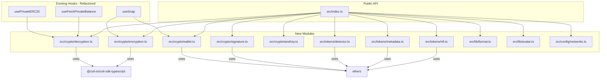
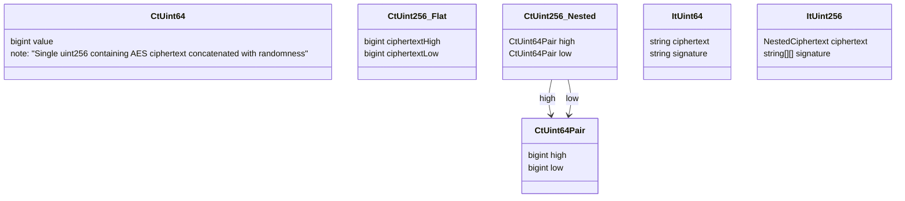

# Design Document: Snap-to-Plugin Migration

## Overview

This design extracts general-purpose cryptographic, token detection, and utility functions from the `coti-snap` MetaMask Snap into the `coti-wallet-plugin` library. The migration introduces five new modules under `src/crypto/`, `src/tokens/`, and extends `src/lib/` and `src/config/`, while refactoring existing hooks to consume the shared implementations.

The architecture follows a layered approach:
- **Pure logic layer** — stateless functions with no I/O (encryption, decryption, formatting, validation)
- **Provider-dependent layer** — functions that require an ethers `Provider` for on-chain reads (token detection, metadata)
- **Hook layer** — React hooks that compose the above layers with wallet state

All new modules are browser-compatible, tree-shakeable, and exported through the existing `src/index.ts` entry point.

## Architecture



### Design Decisions

1. **Separate `crypto/` directory** — Cryptographic operations are isolated from token/contract logic for clear separation of concerns. The `crypto/` module has zero I/O dependencies and can be tested purely.

2. **Provider as parameter, not global** — Token detection and metadata functions accept an `ethers.Provider` parameter rather than constructing one internally. This makes them testable with mocked providers and decouples them from the snap's `ethereum` global.

3. **Snap implementation as canonical source** — Per Requirement 14, the snap's implementations are used as the baseline. The plugin's `useFetchPrivateBalance` threshold (`1e30 * 10^decimals`) is more conservative than the snap's (`1e12 * 10^decimals`), so we expose the threshold as a configurable parameter defaulting to the snap's value.

4. **No Buffer usage** — All byte operations use `Uint8Array` and `TextEncoder`/`TextDecoder` for browser compatibility (Requirement 13).

## Components and Interfaces

### Module: `src/crypto/aesKey.ts`

Handles AES key normalization and validation.

```typescript
/**
 * Strips "0x" prefix and converts to lowercase.
 * Throws if the result is not a valid 32-character hex string.
 */
export function normalizeAesKey(aesKey: string): string;

/**
 * Validates that a string is a valid AES key (32 hex chars after normalization).
 * Returns the normalized key or throws with a descriptive error.
 */
export function validateAesKey(aesKey: string | null | undefined): string;
```

### Module: `src/crypto/decryption.ts`

Decrypts on-chain ciphertext balances.

```typescript
import type { CtUint64, CtUint256 } from '../types/ciphertext';

export interface DecryptionOptions {
  /** Decimal places for formatting (0-18). Default: 18 */
  decimals?: number;
  /** Threshold multiplier for sanity check. Default: 1_000_000_000_000n (1e12) */
  insaneThresholdBase?: bigint;
}

/**
 * Decrypts a 64-bit ciphertext value.
 * Returns the plaintext bigint, or null if AES key is missing/mismatched.
 */
export function decryptCtUint64(
  ciphertext: CtUint64,
  aesKey: string,
  options?: DecryptionOptions
): bigint | null;

/**
 * Decrypts a 256-bit ciphertext value (four 64-bit segments).
 * Returns the reconstructed 256-bit plaintext bigint, or null on failure.
 */
export function decryptCtUint256(
  ciphertext: CtUint256,
  aesKey: string,
  options?: DecryptionOptions
): bigint | null;

/**
 * Unified decryption entry point that auto-detects variant.
 */
export function decryptBalance(
  balance: CtUint64 | CtUint256,
  aesKey: string,
  variant?: 64 | 256,
  options?: DecryptionOptions
): bigint | null;

/**
 * Formats a decrypted bigint into a human-readable decimal string.
 * Divides by 10^decimals, removes trailing zeros.
 */
export function formatDecryptedBalance(
  value: bigint,
  decimals: number
): string;

/**
 * Sanity check: returns true if the value exceeds plausible bounds.
 */
export function isInsaneDecryptedValue(
  value: bigint,
  decimals?: number,
  thresholdBase?: bigint
): boolean;
```

### Module: `src/crypto/encryption.ts`

Constructs encrypted input (IT) structures for smart contract calls.

```typescript
import type { ItUint64, ItUint256 } from '../types/ciphertext';
import { ethers } from 'ethers';

/**
 * Builds an ItUint64 structure for a plaintext value < 2^64.
 * Throws RangeError if plaintext >= 2^64.
 */
export function buildItUint64(
  plaintext: bigint,
  aesKey: string,
  wallet: ethers.Wallet,
  contractAddress: string,
  functionSelector: string
): ItUint64;

/**
 * Builds an ItUint256 structure for a 256-bit plaintext.
 * Splits into four 64-bit segments and encrypts each independently.
 */
export function buildItUint256(
  plaintext: bigint,
  aesKey: string,
  wallet: ethers.Wallet,
  contractAddress: string,
  functionSelector: string
): ItUint256;
```

### Module: `src/crypto/wallet.ts`

Deterministic wallet derivation.

```typescript
import { ethers } from 'ethers';

/**
 * Derives a deterministic ethers Wallet from an AES key, account address, and chain ID.
 * Uses solidityPackedKeccak256(['string','address','string','string'],
 *   ['coti-snap-encryption', account, chainId, normalizedAesKey]) as the private key.
 */
export function deriveWallet(
  aesKey: string,
  account: string,
  chainId: string
): ethers.Wallet;
```

### Module: `src/crypto/signature.ts`

Low-level ECDSA signature helpers.

```typescript
/**
 * Produces a raw ECDSA signature (r, s, v) for a given digest.
 */
export function signDigest(
  privateKey: string,
  digest: string
): { r: string; s: string; v: number };

/**
 * Builds the COTI IT signature: keccak256(signerAddress, contractAddress, selector, ciphertext)
 * signed with the wallet's private key, returned as a 65-byte hex string with normalized v.
 */
export function buildItSignature(
  signerAddress: string,
  contractAddress: string,
  functionSelector: string,
  ciphertext: bigint,
  privateKey: string
): string;

/**
 * Normalizes a signature's v value (27/28 → 0x00/0x01) and returns 65-byte hex.
 */
export function normalizeSignature(sig: {
  r: string;
  s: string;
  v: number;
}): string;
```

### Module: `src/tokens/detector.ts`

Token type detection via ERC165 and bytecode analysis.

```typescript
import { ethers } from 'ethers';

export enum TokenClassification {
  ERC20 = 'erc20',
  ConfidentialERC20_64 = 'confidential-erc20-64',
  ConfidentialERC20_256 = 'confidential-erc20-256',
  ERC721 = 'erc721',
  ERC1155 = 'erc1155',
  Unknown = 'unknown',
}

export interface DetectionResult {
  classification: TokenClassification;
  confidential: boolean;
  confidentialVersion?: 64 | 256;
}

/**
 * Detects the token type for a given contract address.
 * Probes ERC165 interfaces in precedence order, falls back to bytecode analysis.
 * Times out after 10 seconds.
 */
export async function detectTokenType(
  address: string,
  provider: ethers.Provider
): Promise<DetectionResult>;

/**
 * Probes whether a token supports 256-bit confidential operations.
 * Optionally checks accountEncryptionAddress for a specific account.
 */
export async function probeConfidentialVersion256(
  address: string,
  provider: ethers.Provider,
  accountAddress?: string
): Promise<boolean>;
```

### Module: `src/tokens/metadata.ts`

ERC20 metadata fetching with caching.

```typescript
import { ethers } from 'ethers';

export interface ERC20Metadata {
  name: string | null;
  symbol: string | null;
  decimals: number | null;
}

/**
 * Fetches ERC20 metadata (name, symbol, decimals) for a token address.
 * Caches results in memory per provider instance.
 * Returns null if all calls revert.
 */
export async function getERC20Metadata(
  address: string,
  provider: ethers.Provider
): Promise<ERC20Metadata | null>;
```

### Module: `src/tokens/nft.ts`

ERC721 operations including confidential token URI decryption.

```typescript
import { ethers } from 'ethers';

export interface ERC721Metadata {
  name: string | null;
  symbol: string | null;
}

/**
 * Fetches ERC721 collection metadata.
 */
export async function getERC721Metadata(
  address: string,
  provider: ethers.Provider
): Promise<ERC721Metadata | null>;

/**
 * Verifies ERC721 token ownership.
 */
export async function verifyERC721Ownership(
  address: string,
  tokenId: string,
  ownerAddress: string,
  provider: ethers.Provider
): Promise<boolean>;

/**
 * Decrypts a confidential NFT's token URI.
 */
export async function getConfidentialTokenURI(
  address: string,
  tokenId: string,
  aesKey: string,
  provider: ethers.Provider
): Promise<string | null>;

/**
 * Fetches a public NFT's token URI, resolving IPFS URIs through a gateway.
 */
export async function getPublicTokenURI(
  address: string,
  tokenId: string,
  provider: ethers.Provider
): Promise<string | null>;

/**
 * Resolves an IPFS URI to an HTTP gateway URL.
 */
export function resolveIpfsUri(uri: string, gateway?: string): string;
```

### Module: `src/lib/format.ts`

Extended formatting utilities (supplements existing `src/lib/utils.ts`).

```typescript
/**
 * Truncates an Ethereum address to show first and last N characters.
 * Example: truncateAddress("0xAbC...123", 6) → "0xAbC...23"
 */
export function truncateAddress(address: string, length?: number): string;
```

### Module: `src/lib/avatar.ts`

Token avatar generation.

```typescript
/**
 * Generates a deterministic SVG avatar from a token symbol.
 * Uses the first letter on a gray circular background.
 */
export function generateTokenAvatar(symbol: string): string;
```

### Module: `src/config/networks.ts`

Unified network configuration.

```typescript
export interface NetworkConfig {
  chainId: number;
  networkName: string;
  rpcUrl: string;
  explorerUrl: string;
  isTestnet: boolean;
}

export const NETWORK_CONFIGS: Record<number, NetworkConfig>;

/**
 * Returns the NetworkConfig for a given chain ID.
 * Throws if the chain ID is not a supported COTI network.
 */
export function getNetworkConfig(chainId: number): NetworkConfig;
```

### Module: `src/types/ciphertext.ts`

Type definitions for ciphertext structures.

```typescript
/** A single 64-bit encrypted value (uint256 containing ciphertext + randomness) */
export type CtUint64 = bigint;

/** A 256-bit encrypted value composed of four 64-bit segments */
export type CtUint256 =
  | { ciphertextHigh: bigint; ciphertextLow: bigint }
  | { high: { high: bigint; low: bigint }; low: { high: bigint; low: bigint } };

/** Encrypted input for 64-bit contract calls */
export interface ItUint64 {
  ciphertext: string;
  signature: string;
}

/** Encrypted input for 256-bit contract calls */
export interface ItUint256 {
  ciphertext: {
    high: { high: string; low: string };
    low: { high: string; low: string };
  };
  signature: [[string, string], [string, string]];
}

/** Type guard: checks if a value conforms to the CtUint256 shape */
export function isCtUint256(value: unknown): value is CtUint256;

/** Type guard: checks if a CtUint256 is all zeros */
export function isZeroCtUint256(value: unknown): boolean;
```

## Data Models

### Ciphertext Structures



### Network Configuration

| Field | Type | Mainnet | Testnet |
|-------|------|---------|---------|
| chainId | number | 2632500 | 7082400 |
| networkName | string | "COTI Mainnet" | "COTI Testnet" |
| rpcUrl | string | https://mainnet.coti.io/rpc | https://testnet.coti.io/rpc |
| explorerUrl | string | https://mainnet.cotiscan.io | https://testnet.cotiscan.io |
| isTestnet | boolean | false | true |

### Token Classification Enum

| Value | Interface ID | Description |
|-------|-------------|-------------|
| `erc20` | — | Standard ERC20 (bytecode fallback) |
| `confidential-erc20-64` | 0x8409a9cf | COTI Confidential ERC20, 64-bit |
| `confidential-erc20-256` | 0xdfeb393e | COTI Confidential ERC20, 256-bit |
| `erc721` | 0x80ac58cd | Standard/Confidential ERC721 |
| `erc1155` | 0xd9b67a26 | ERC1155 Multi-Token |
| `unknown` | — | Unrecognized contract |

## Correctness Properties

*A property is a characteristic or behavior that should hold true across all valid executions of a system — essentially, a formal statement about what the system should do. Properties serve as the bridge between human-readable specifications and machine-verifiable correctness guarantees.*

### Property 1: Decryption Round-Trip

*For any* plaintext bigint in the range [0, 2^64 - 1] and any valid 32-character hex AES key, encrypting the plaintext with the SDK's `encrypt` function and then decrypting the result with `decryptCtUint64` SHALL produce the original plaintext value.

**Validates: Requirements 1.1, 1.2**

### Property 2: Sanity Guard Threshold

*For any* bigint value and decimals parameter (0–18), `isInsaneDecryptedValue(value, decimals, thresholdBase)` SHALL return true if and only if `value > thresholdBase * 10^decimals`, and the decryption functions SHALL return null for values exceeding this threshold.

**Validates: Requirements 1.4, 1.5**

### Property 3: Balance Formatting Correctness

*For any* non-negative bigint and decimals value (0–18), `formatDecryptedBalance(value, decimals)` SHALL produce a string that, when parsed back as a decimal number and multiplied by 10^decimals, equals the original bigint (within rounding from trailing zero removal).

**Validates: Requirements 1.3**

### Property 4: AES Key Normalization Canonicalization

*For any* valid 32-character hex string `k`, `normalizeAesKey("0x" + k)` SHALL equal `normalizeAesKey(k)`, and `normalizeAesKey(k.toUpperCase())` SHALL equal `normalizeAesKey(k.toLowerCase())`, and the result SHALL always be a 32-character lowercase hex string.

**Validates: Requirements 2.1, 2.2, 2.3**

### Property 5: AES Key Validation Rejects Invalid Keys

*For any* string that is either not composed entirely of hexadecimal characters (after 0x prefix removal) or does not have exactly 32 hex characters after normalization, `validateAesKey` SHALL throw an error.

**Validates: Requirements 2.4, 2.5**

### Property 6: IT Construction Round-Trip with Valid Signature

*For any* plaintext bigint in [0, 2^64 - 1], valid AES key, valid wallet, valid contract address, and valid 4-byte function selector, `buildItUint64` SHALL produce an `ItUint64` where: (a) decrypting the ciphertext field recovers the original plaintext, and (b) recovering the ECDSA signer from the signature and the expected digest yields the wallet's address.

**Validates: Requirements 3.1, 3.2, 3.5**

### Property 7: IT256 Construction Round-Trip

*For any* 256-bit plaintext bigint, valid AES key, valid wallet, valid contract address, and valid function selector, `buildItUint256` SHALL produce an `ItUint256` where decrypting all four ciphertext segments and reconstructing via `(d1 << 192) + (d2 << 128) + (d3 << 64) + d4` yields the original plaintext.

**Validates: Requirements 3.3**

### Property 8: IT Construction Overflow Rejection

*For any* bigint value >= 2^64, calling `buildItUint64` SHALL throw a `RangeError`.

**Validates: Requirements 3.4**

### Property 9: Wallet Derivation Determinism

*For any* valid AES key (with or without 0x prefix, any case), valid Ethereum address, and chain ID string, `deriveWallet` SHALL always produce the same wallet address, and `deriveWallet(key, addr, chainId).address === deriveWallet(normalize(key), addr, chainId).address`.

**Validates: Requirements 4.1, 4.3, 4.4**

### Property 10: Ciphertext Shape Validation

*For any* object with the nested structure `{ high: { high, low }, low: { high, low } }` where all leaf values are bigints or strings, `isCtUint256` SHALL return true; and for any object not matching this or the flat `{ ciphertextHigh, ciphertextLow }` structure, it SHALL return false.

**Validates: Requirements 10.1, 10.2**

### Property 11: Address Truncation Preserves Endpoints

*For any* valid 42-character Ethereum address and display length N (where 4 ≤ N < 42), `truncateAddress(address, N)` SHALL produce a string whose first `ceil(N/2)` characters match the address prefix and whose last `floor(N/2)` characters match the address suffix, with "..." in between.

**Validates: Requirements 11.1**

### Property 12: Signature Production and Normalization

*For any* valid 32-byte private key and 32-byte message digest, `signDigest` SHALL produce a signature where the recovered public key matches the signer's address, and `normalizeSignature` SHALL produce a 65-byte hex string (130 hex chars + "0x" prefix) with the final byte being 0x00 or 0x01.

**Validates: Requirements 12.1, 12.2, 12.3**

## Error Handling

| Module | Error Condition | Behavior |
|--------|----------------|----------|
| `aesKey.ts` | Key is null/undefined/empty | Throws `Error("AES key is required")` |
| `aesKey.ts` | Key contains non-hex chars | Throws `Error("Invalid AES key: contains non-hexadecimal characters")` |
| `aesKey.ts` | Key length ≠ 32 after normalization | Throws `Error("Invalid AES key: expected 32 hex characters, got N")` |
| `decryption.ts` | AES key missing | Returns `null` |
| `decryption.ts` | Decrypted value exceeds sanity threshold | Returns `null` |
| `decryption.ts` | SDK decryption throws | Returns `null`, logs error |
| `encryption.ts` | Plaintext ≥ 2^64 for ItUint64 | Throws `RangeError("Plaintext size must be 64 bits or smaller")` |
| `encryption.ts` | Missing wallet/address/selector | Throws `Error` with parameter name |
| `wallet.ts` | Invalid AES key | Throws via `validateAesKey` |
| `wallet.ts` | Invalid Ethereum address | Throws `Error("Invalid Ethereum address")` |
| `detector.ts` | RPC timeout (>10s) | Returns `{ classification: 'unknown' }` |
| `detector.ts` | No bytecode at address | Returns `{ classification: 'unknown' }` |
| `metadata.ts` | Individual call reverts | Returns `null` for that field |
| `metadata.ts` | All calls revert | Returns `null` |
| `networks.ts` | Unsupported chain ID | Throws `Error("Unsupported COTI chain ID: N")` |

All provider-dependent functions use `AbortController` with a 10-second timeout to prevent hanging on unresponsive RPCs.

## Testing Strategy

### Property-Based Testing

This feature is well-suited for property-based testing because the core modules are pure functions with clear input/output behavior and large input spaces (arbitrary bigints, hex strings, addresses).

**Library**: [fast-check](https://github.com/dubzzz/fast-check) (TypeScript-native, works with vitest/jest)

**Configuration**:
- Minimum 100 iterations per property test
- Each test tagged with: `Feature: snap-to-plugin-migration, Property N: <title>`

**Properties to implement as PBT**:
1. Decryption round-trip (Property 1)
2. Sanity guard threshold (Property 2)
3. Balance formatting correctness (Property 3)
4. AES key normalization (Property 4)
5. AES key validation rejection (Property 5)
6. IT construction round-trip (Property 6)
7. IT256 construction round-trip (Property 7)
8. IT overflow rejection (Property 8)
9. Wallet derivation determinism (Property 9)
10. Ciphertext shape validation (Property 10)
11. Address truncation (Property 11)
12. Signature production (Property 12)

### Unit Tests (Example-Based)

- Network config lookup for known chain IDs (9.1, 9.2)
- Token detection with mocked providers returning specific interface support (5.1–5.9)
- ERC20 metadata fetching with mocked contracts (7.1–7.4)
- ERC721 operations with mocked contracts (8.1–8.5)
- Confidential version probing with mocked responses (6.1–6.5)
- SVG avatar contains first letter of symbol (11.3)

### Integration Tests

- Token detection against a local hardhat/anvil fork with deployed test contracts
- End-to-end encryption → on-chain submission → decryption flow (requires test network)

### Test File Structure

```
tests/
├── crypto/
│   ├── aesKey.property.test.ts
│   ├── decryption.property.test.ts
│   ├── encryption.property.test.ts
│   ├── wallet.property.test.ts
│   └── signature.property.test.ts
├── tokens/
│   ├── detector.test.ts
│   ├── metadata.test.ts
│   └── nft.test.ts
├── lib/
│   ├── format.property.test.ts
│   └── avatar.test.ts
├── config/
│   └── networks.test.ts
└── types/
    └── ciphertext.property.test.ts
```
