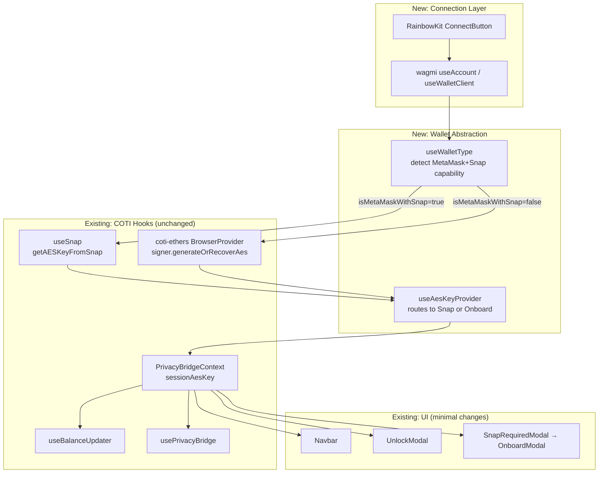
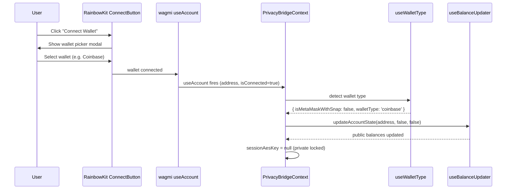
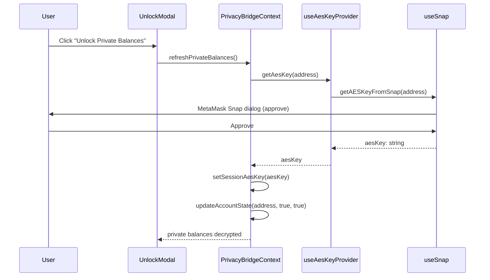
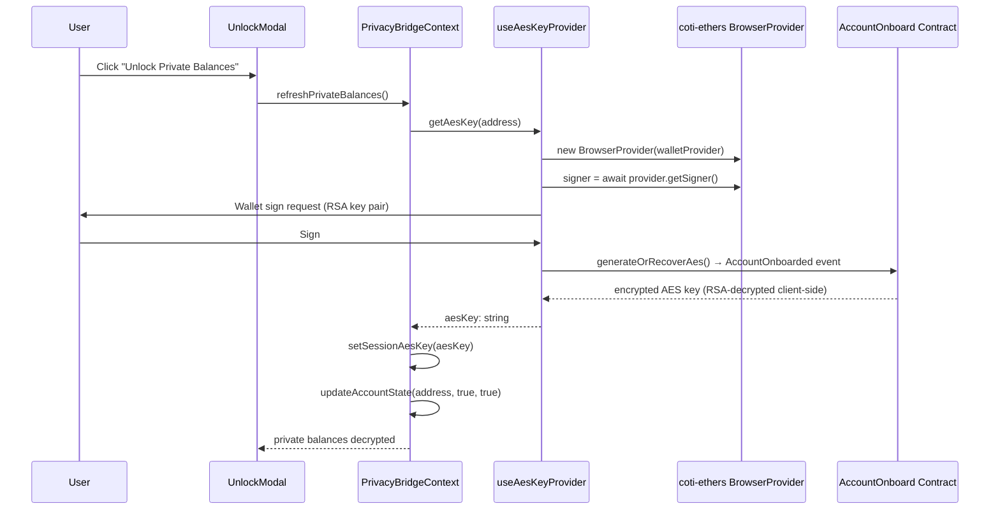
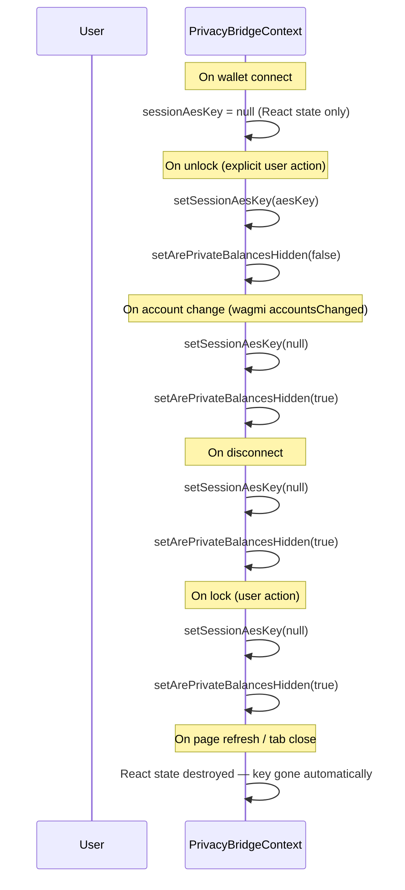

# Design Document: RainbowKit Multi-Wallet Support

## Overview

The COTI Privacy Bridge dApp currently supports only MetaMask with the COTI Snap for AES key retrieval and private balance decryption. This feature adds RainbowKit + wagmi v2 as the wallet connection layer, enabling any EIP-1193 wallet (Coinbase Wallet, WalletConnect, Rainbow, etc.) to connect and interact with the bridge. For non-MetaMask wallets, the AES key is retrieved via the `@coti-io/coti-ethers` onboarding contract flow instead of the Snap.

The core challenge is that private token balances are AES-256 encrypted on-chain. The AES key is currently retrieved exclusively via `wallet_invokeSnap` → `get-aes-key`. This design introduces a **wallet abstraction layer** — a `useAesKeyProvider` hook — that routes AES key retrieval to either the Snap path (MetaMask) or the onboarding contract path (`signer.generateOrRecoverAes()`) depending on the detected wallet type. All downstream consumers (`useBalanceUpdater`, `usePrivacyBridge`) remain unchanged; they continue to receive `sessionAesKey: string | null` from context.

The existing MetaMask + Snap flow is preserved exactly as-is. RainbowKit is layered on top as the new connection entry point, replacing `useMetamask`'s `connectWallet` for the UI while keeping all COTI-specific logic intact.

## Architecture

The wallet abstraction layer sits between the RainbowKit/wagmi connection layer and the existing COTI-specific hooks. It intercepts the connected wallet's EIP-1193 provider and routes AES key retrieval to the correct path.



### Key Architectural Decisions

1. **wagmi as the single source of truth for wallet state** — `useAccount`, `useWalletClient`, and `usePublicClient` replace `window.ethereum` direct calls in the connection layer. The existing hooks (`useBalanceUpdater`, `usePrivacyBridge`, `useFetchPrivateBalance`) continue using `window.ethereum` / `ethers.BrowserProvider` internally since they are already wallet-agnostic at the ethers level.

2. **`useAesKeyProvider` as the abstraction boundary** — This new hook is the only place that knows about wallet type. It exposes a single `getAesKey(address): Promise<string | null>` function. `PrivacyBridgeContext` calls this instead of calling `getAESKeyFromSnap` directly.

3. **MetaMask Snap path unchanged** — When `isMetaMaskWithSnap` is true, `useAesKeyProvider` delegates directly to `useSnap.getAESKeyFromSnap`. No changes to `useSnap.ts`.

4. **Onboarding contract path for non-MetaMask** — Uses `@coti-io/coti-ethers` `BrowserProvider` + `signer.generateOrRecoverAes()`. The EIP-1193 provider passed to `BrowserProvider` comes from wagmi's `useConnectorClient` (which wraps the active wallet's provider).

5. **`PrivacyBridgeContext` refactored minimally** — `handleConnect` is replaced by RainbowKit's `ConnectButton`. The context still owns `sessionAesKey`, `isConnected`, `walletAddress`, and all downstream state. wagmi's `useAccount` hook drives `isConnected` and `walletAddress`.

## Sequence Diagrams

### 1. Wallet Connection Flow (RainbowKit)



### 2. AES Key Retrieval — MetaMask + Snap Path



### 3. AES Key Retrieval — Non-MetaMask Onboarding Contract Path



### 4. Session Key Lifecycle



> **Security note**: The AES key is held exclusively in React component state (`useState`). It is never written to `localStorage`, `sessionStorage`, `IndexedDB`, cookies, or any other browser-persistent storage. Any JS running on the page (including injected scripts) cannot read React's internal fiber state directly. The key is lost on page refresh by design — users must re-unlock, which is the intended security trade-off.

## Security Considerations

### Threat Model

The AES key is the most sensitive piece of data in this application. If an attacker obtains it, they can decrypt the user's private on-chain balances. The threat vectors addressed are:

| Threat | Mitigation |
|--------|-----------|
| **XSS (Cross-Site Scripting)** | Key lives only in React state — not in any DOM-accessible storage. A script injected via XSS cannot enumerate React fiber state without deep runtime introspection. Combined with a strict CSP, this significantly raises the bar. |
| **Malicious browser extensions** | Extensions can read `localStorage`, `sessionStorage`, and `IndexedDB` trivially. By keeping the key in React state only, it is not accessible via standard extension APIs. |
| **Other origins / iframes** | Same-origin policy prevents cross-origin JS from accessing this app's memory. The key never touches any storage that could be shared across origins. |
| **Shoulder surfing / screen capture** | Private balances are hidden by default (`arePrivateBalancesHidden = true`). The key is never rendered to the DOM. |
| **Network interception** | The AES key is never sent over the network. Decryption happens entirely client-side using `CotiSDK.decryptUint256`. |
| **Connector identity spoofing** | `useWalletType` uses `connector.id` from wagmi (a stable, wagmi-controlled identifier) rather than `window.ethereum.isMetaMask`, which any wallet can spoof. |
| **WalletConnect relay eavesdropping** | WalletConnect v2 uses end-to-end encryption between dApp and wallet. The AES key is never transmitted through WalletConnect — only standard EIP-1193 signing requests are made. |
| **Page refresh / tab close** | React state is destroyed on refresh. The key is gone. Users must re-unlock, which is the intended security trade-off (no persistence = no persistent attack surface). |

### Key Storage Rules (absolute, no exceptions)

- The AES key MUST NOT be written to `localStorage`
- The AES key MUST NOT be written to `sessionStorage`
- The AES key MUST NOT be written to `IndexedDB`
- The AES key MUST NOT be set as a cookie
- The AES key MUST NOT appear in any URL, query parameter, or hash fragment
- The AES key MUST NOT appear in console logs, error messages, or analytics events
- The AES key MUST NOT be sent to any backend or third-party service

### Content Security Policy (CSP)

The app should enforce a strict CSP to reduce XSS risk. Recommended headers:

```
Content-Security-Policy:
  default-src 'self';
  script-src 'self';
  connect-src 'self' https://*.coti.io wss://*.walletconnect.com https://*.walletconnect.com;
  frame-ancestors 'none';
```

- `script-src 'self'` — no inline scripts, no eval, no external script injection
- `frame-ancestors 'none'` — prevents clickjacking via iframe embedding
- No `unsafe-inline` or `unsafe-eval` — eliminates the most common XSS escalation paths

### Additional Hardening

- **RSA key pair is ephemeral**: `generateOrRecoverAes()` generates the RSA key pair internally and never exposes the private key outside the call stack. The AES key is the only output.
- **No AES key in URL, logs, or error messages**: All logging uses truncated or hashed representations (e.g. first 4 chars only for debugging).
- **WalletConnect project ID**: Stored in `VITE_WALLETCONNECT_PROJECT_ID` env var — never hardcoded.
- **Network enforcement**: `useNetworkEnforcer` continues to enforce COTI-only networks. wagmi's `useSwitchChain` is used for non-MetaMask wallets.
- **Connector identity check**: `useWalletType` uses `connector.id` (wagmi's stable identifier) rather than `window.ethereum.isMetaMask` (easily spoofed by other wallets).

## Components and Interfaces

### Component 1: `useWalletType` (new hook)

**Purpose**: Detects whether the currently connected wallet is MetaMask with COTI Snap capability. Returns a stable wallet type descriptor used by `useAesKeyProvider` to route AES key retrieval.

**Interface**:
```typescript
interface WalletTypeInfo {
  isMetaMaskWithSnap: boolean
  walletType: 'metamask' | 'coinbase' | 'walletconnect' | 'rainbow' | 'unknown'
  connectorId: string | undefined
}

function useWalletType(): WalletTypeInfo
```

**Responsibilities**:
- Read `connector` from wagmi's `useAccount`
- Check `connector.id` or `connector.name` for MetaMask identity
- Optionally call `isSnapInstalled()` from `useSnap` to confirm Snap availability
- Return stable object (memoized) to avoid re-render loops

---

### Component 2: `useAesKeyProvider` (new hook)

**Purpose**: Single abstraction for AES key retrieval. Routes to Snap or onboarding contract based on wallet type. Consumed by `PrivacyBridgeContext` in place of direct `getAESKeyFromSnap` calls.

**Interface**:
```typescript
interface AesKeyProviderResult {
  getAesKey: (address: string) => Promise<string | null>
  isOnboarding: boolean
  onboardingError: string | null
}

function useAesKeyProvider(walletTypeInfo: WalletTypeInfo): AesKeyProviderResult
```

**Responsibilities**:
- If `isMetaMaskWithSnap`: delegate to `useSnap.getAESKeyFromSnap(address)`
- If not: use `@coti-io/coti-ethers` `BrowserProvider` + `signer.generateOrRecoverAes()`
- Expose `isOnboarding` loading state for UI feedback
- Expose `onboardingError` for error display
- Never persist AES key to localStorage; return it for context to store in React state

---

### Component 3: `WagmiRainbowKitProvider` (new wrapper component)

**Purpose**: Wraps the app with wagmi `WagmiProvider` + `QueryClientProvider` + `RainbowKitProvider`. Replaces the need for `handleConnect` in `PrivacyBridgeContext`.

**Interface**:
```typescript
function WagmiRainbowKitProvider({ children }: { children: React.ReactNode }): JSX.Element
```

**Responsibilities**:
- Configure wagmi with COTI Mainnet + Testnet chains
- Configure RainbowKit with desired wallets (MetaMask, Coinbase, WalletConnect, Rainbow)
- Provide `QueryClient` for wagmi's internal caching
- Set `appName` and `projectId` (WalletConnect Cloud project ID)

---

### Component 4: `PrivacyBridgeContext` (modified)

**Purpose**: Central context — now drives `isConnected` / `walletAddress` from wagmi's `useAccount` instead of `useMetamask`. Delegates AES key retrieval to `useAesKeyProvider`.

**Changes**:
- Remove `handleConnect` (replaced by RainbowKit `ConnectButton`)
- Remove `useMetamask` dependency for connection (keep for `checkNetwork`, `switchNetwork`)
- Add `useAccount` from wagmi for `isConnected`, `walletAddress`
- Replace `getAESKeyFromSnap` calls with `useAesKeyProvider.getAesKey`
- Keep `sessionAesKey`, `refreshPrivateBalances`, `lockPrivateBalances` unchanged

---

### Component 5: `Navbar` (modified)

**Purpose**: Replace the single "Connect Wallet" button with two distinct connection buttons — one for MetaMask and one for other wallets via RainbowKit.

**Changes**:
- Rename the existing "Connect Wallet" button to **"Connect MetaMask"** — retains the current `handleConnect` MetaMask flow
- Add a second button **"Connect COTI Wallet"** — opens the RainbowKit modal (Coinbase Wallet, WalletConnect, Rainbow, etc.) using `useConnectModal` from `@rainbow-me/rainbowkit`
- When `isConnected` (either path), hide both buttons and show the existing address dropdown unchanged
- Keep disconnect dropdown, network switcher, and snap error button unchanged
- Remove `showInstallModal` and `metamaskDetected` from the connect button area (MetaMask detection is handled by the existing flow)

---

### Component 6: `OnboardModal` (new, replaces `SnapRequiredModal` for non-MetaMask)

**Purpose**: Shown when a non-MetaMask wallet user needs to complete the onboarding contract flow to retrieve their AES key.

**Interface**:
```typescript
interface OnboardModalProps {
  isOpen: boolean
  onClose: () => void
  onConfirm: () => void
  isLoading: boolean
  error: string | null
  walletType: string
}
```

**Responsibilities**:
- Explain that a signature is needed to retrieve the AES key via the COTI onboarding contract
- Show loading state while `generateOrRecoverAes()` is in progress
- Show error state with retry option
- For MetaMask users: show existing `SnapRequiredModal` flow unchanged

## Data Models

### WalletTypeInfo

```typescript
interface WalletTypeInfo {
  // True only when connector is MetaMask AND Snap is installed/visible
  isMetaMaskWithSnap: boolean
  // Normalized wallet identifier
  walletType: 'metamask' | 'coinbase' | 'walletconnect' | 'rainbow' | 'unknown'
  // Raw wagmi connector id (e.g. 'metaMask', 'coinbaseWallet', 'walletConnect')
  connectorId: string | undefined
}
```

**Validation Rules**:
- `isMetaMaskWithSnap` is `false` by default until Snap check completes
- `walletType` is derived from `connectorId` via a static mapping
- Never throws; returns `{ isMetaMaskWithSnap: false, walletType: 'unknown' }` on error

---

### SessionKeyState

```typescript
interface SessionKeyState {
  // AES key in React state ONLY — never written to any browser storage
  sessionAesKey: string | null
  // True when key is present AND private balances are not manually locked
  isPrivateUnlocked: boolean
  // Source of the current key (for debugging/UI hints)
  keySource: 'snap' | 'onboard-contract' | null
}
```

**Validation Rules**:
- `sessionAesKey` cleared on: disconnect, account change, manual lock, page refresh
- `sessionAesKey` is NEVER written to `localStorage`, `sessionStorage`, `IndexedDB`, or cookies
- `keySource` is informational only; does not affect downstream decryption logic
- AES key format: 32-byte hex string (64 hex chars), validated before storing

---

### OnboardingState (for non-MetaMask path)

```typescript
interface OnboardingState {
  isOnboarding: boolean
  onboardingError: string | null
  // The ephemeral RSA key pair — generated fresh per session, never persisted
  rsaKeyPair: { publicKey: string; privateKey: string } | null
}
```

**Validation Rules**:
- `rsaKeyPair` is generated inside `generateOrRecoverAes()` by `@coti-io/coti-ethers` — never stored outside the call stack
- `onboardingError` is cleared on retry
- `isOnboarding` is `true` only during the async `generateOrRecoverAes()` call

---

### COTI Chain Configs (for wagmi)

```typescript
import { defineChain } from 'viem'

const cotiMainnet = defineChain({
  id: 2632500,
  name: 'COTI Mainnet',
  nativeCurrency: { name: 'COTI', symbol: 'COTI', decimals: 18 },
  rpcUrls: { default: { http: ['https://mainnet.coti.io/rpc'] } },
  blockExplorers: { default: { name: 'CotiScan', url: 'https://mainnet.cotiscan.io' } },
})

const cotiTestnet = defineChain({
  id: 7082400,
  name: 'COTI Testnet',
  nativeCurrency: { name: 'COTI', symbol: 'COTI', decimals: 18 },
  rpcUrls: { default: { http: ['https://testnet.coti.io/rpc'] } },
  blockExplorers: { default: { name: 'CotiScan', url: 'https://testnet.cotiscan.io' } },
})
```

## Algorithmic Pseudocode

### Algorithm 1: Wallet Type Detection

```pascal
ALGORITHM detectWalletType(connector)
INPUT: connector from wagmi useAccount (may be undefined)
OUTPUT: WalletTypeInfo

BEGIN
  IF connector IS undefined OR null THEN
    RETURN { isMetaMaskWithSnap: false, walletType: 'unknown', connectorId: undefined }
  END IF

  connectorId ← connector.id.toLowerCase()

  walletType ←
    IF connectorId CONTAINS 'metamask' THEN 'metamask'
    ELSE IF connectorId CONTAINS 'coinbase' THEN 'coinbase'
    ELSE IF connectorId CONTAINS 'walletconnect' THEN 'walletconnect'
    ELSE IF connectorId CONTAINS 'rainbow' THEN 'rainbow'
    ELSE 'unknown'
    END IF

  IF walletType = 'metamask' THEN
    // Check Snap availability without side effects
    snapInstalled ← await isSnapInstalled()  // wallet_getSnaps only
    RETURN { isMetaMaskWithSnap: snapInstalled, walletType: 'metamask', connectorId: connector.id }
  END IF

  RETURN { isMetaMaskWithSnap: false, walletType, connectorId: connector.id }
END
```

**Preconditions**:
- `connector` is the wagmi connector object or undefined
- `isSnapInstalled()` uses only `wallet_getSnaps` — no dialogs, no side effects

**Postconditions**:
- Returns a valid `WalletTypeInfo` in all cases (never throws)
- `isMetaMaskWithSnap` is `false` if Snap check fails or times out

---

### Algorithm 2: AES Key Retrieval (Abstracted)

```pascal
ALGORITHM getAesKey(address, walletTypeInfo, walletProvider)
INPUT:
  address: string (checksummed wallet address)
  walletTypeInfo: WalletTypeInfo
  walletProvider: EIP-1193 provider from wagmi connector
OUTPUT: aesKey: string | null

BEGIN
  IF walletTypeInfo.isMetaMaskWithSnap THEN
    // Snap path — unchanged from current implementation
    aesKey ← await getAESKeyFromSnap(address)
    RETURN aesKey
  END IF

  // Onboarding contract path
  ASSERT walletProvider IS NOT null

  provider ← new CotiEthers.BrowserProvider(walletProvider)
  signer ← await provider.getSigner()

  ASSERT signer.getAddress() = address

  // This call:
  //   1. Generates ephemeral RSA key pair (in memory only)
  //   2. Signs RSA public key with wallet (personal_sign)
  //   3. Calls AccountOnboard contract
  //   4. Listens for AccountOnboarded event
  //   5. Decrypts AES key with RSA private key client-side
  await signer.generateOrRecoverAes()

  onboardInfo ← signer.getUserOnboardInfo()

  IF onboardInfo IS null OR onboardInfo.aesKey IS null THEN
    RETURN null
  END IF

  aesKey ← onboardInfo.aesKey

  ASSERT aesKey.length = 64  // 32-byte hex string
  ASSERT aesKey MATCHES /^[0-9a-fA-F]{64}$/

  RETURN aesKey
END
```

**Preconditions**:
- `address` is a valid checksummed Ethereum address
- `walletProvider` is a valid EIP-1193 provider (from wagmi `useConnectorClient`)
- For Snap path: Snap must be installed and visible via `wallet_getSnaps`

**Postconditions**:
- Returns 64-char hex AES key string on success
- Returns `null` if user rejects signature or onboarding fails
- RSA key pair is ephemeral — never stored outside the `generateOrRecoverAes()` call stack
- AES key is NOT written to localStorage or sessionStorage by this function (caller's responsibility)

**Loop Invariants**: N/A (no loops; async sequential operations)

---

### Algorithm 3: Session Key Lifecycle Management

```pascal
ALGORITHM manageSessionKey(event, aesKey?)
INPUT:
  event: 'unlock' | 'lock' | 'account-change' | 'disconnect'
  aesKey?: string (required for 'unlock' event)
OUTPUT: void (side effects on React state ONLY — no browser storage writes)

BEGIN
  MATCH event WITH
    | 'unlock' →
        ASSERT aesKey IS NOT null AND aesKey.length = 64
        setSessionAesKey(aesKey)          // React state only
        setArePrivateBalancesHidden(false)

    | 'lock' →
        setSessionAesKey(null)            // React state cleared
        setArePrivateBalancesHidden(true)
        setPrivateTokens(getInitialPrivateTokens())
        clearSnapCache()                  // only relevant for MetaMask path

    | 'account-change' →
        setSessionAesKey(null)            // React state cleared
        setArePrivateBalancesHidden(true)
        clearSnapCache()

    | 'disconnect' →
        setSessionAesKey(null)            // React state cleared
        setArePrivateBalancesHidden(true)
        setIsConnected(false)
        setWalletAddress('')
        clearSnapCache()
  END MATCH
END
```

**Preconditions**:
- React state setters are available in scope

**Postconditions**:
- After 'unlock': `sessionAesKey` is non-null in React state, `isPrivateUnlocked` is true
- After 'lock'/'account-change'/'disconnect': `sessionAesKey` is null, `isPrivateUnlocked` is false
- AES key is NEVER written to `localStorage`, `sessionStorage`, `IndexedDB`, or cookies
- On page refresh: React state is destroyed and key is gone — user must re-unlock

## Key Functions with Formal Specifications

### `useWalletType(): WalletTypeInfo`

```typescript
function useWalletType(): WalletTypeInfo
```

**Preconditions**:
- Must be called inside a wagmi `WagmiProvider` context
- `useAccount` from wagmi must be available

**Postconditions**:
- Returns `WalletTypeInfo` with `isMetaMaskWithSnap: false` until async Snap check resolves
- `walletType` is always one of the defined union values
- Never throws; errors are swallowed and result in `walletType: 'unknown'`

---

### `useAesKeyProvider(walletTypeInfo): AesKeyProviderResult`

```typescript
function useAesKeyProvider(walletTypeInfo: WalletTypeInfo): AesKeyProviderResult
```

**Preconditions**:
- `walletTypeInfo` is a valid `WalletTypeInfo` object
- For non-MetaMask path: wagmi `useConnectorClient` must return a valid client

**Postconditions**:
- `getAesKey(address)` returns a 64-char hex string or `null`
- `isOnboarding` is `true` only during the async `generateOrRecoverAes()` call
- `onboardingError` is set if `generateOrRecoverAes()` throws; cleared on next call

---

### `getAesKeyViaOnboardContract(address, walletProvider): Promise<string | null>`

```typescript
async function getAesKeyViaOnboardContract(
  address: string,
  walletProvider: Eip1193Provider
): Promise<string | null>
```

**Preconditions**:
- `address` matches the address returned by `signer.getAddress()`
- `walletProvider` is a valid EIP-1193 provider
- Network is COTI Testnet (7082400) or Mainnet (2632500)

**Postconditions**:
- On success: returns 64-char hex AES key
- On user rejection (EIP-1193 error code 4001): returns `null`
- On network error: throws with descriptive message
- RSA key pair generated inside `generateOrRecoverAes()` is never accessible outside this function

---

### `WagmiRainbowKitProvider` configuration

```typescript
const wagmiConfig = createConfig({
  chains: [cotiMainnet, cotiTestnet],
  connectors: [
    injected(),           // MetaMask and other injected wallets
    coinbaseWallet({ appName: 'COTI Privacy Bridge' }),
    walletConnect({ projectId: WALLETCONNECT_PROJECT_ID }),
  ],
  transports: {
    [cotiMainnet.id]: http('https://mainnet.coti.io/rpc'),
    [cotiTestnet.id]: http('https://testnet.coti.io/rpc'),
  },
})
```

**Preconditions**:
- `WALLETCONNECT_PROJECT_ID` is set in environment variables (`VITE_WALLETCONNECT_PROJECT_ID`)
- COTI chain definitions are valid viem `Chain` objects

**Postconditions**:
- wagmi config supports both COTI networks
- All three connector types are available in RainbowKit modal
- `injected()` connector handles MetaMask (and other injected wallets)

## Example Usage

### Setting up the provider tree (`main.tsx`)

```typescript
import { WagmiRainbowKitProvider } from './providers/WagmiRainbowKitProvider'
import { PrivacyBridgeProvider } from './context/PrivacyBridgeContext'

ReactDOM.createRoot(document.getElementById('root')!).render(
  <React.StrictMode>
    <WagmiRainbowKitProvider>
      <PrivacyBridgeProvider>
        <App />
      </PrivacyBridgeProvider>
    </WagmiRainbowKitProvider>
  </React.StrictMode>
)
```

### Navbar with dual connect buttons

```typescript
import { useConnectModal } from '@rainbow-me/rainbowkit'

// In Navbar.tsx — replace the connect button section:
const { openConnectModal } = useConnectModal()

{isConnected ? (
  <DropdownMenu>
    {/* existing address dropdown — unchanged */}
  </DropdownMenu>
) : (
  <div className="flex gap-2">
    {/* Existing MetaMask flow — button renamed */}
    <Button onClick={handleConnect}>Connect MetaMask</Button>
    {/* New RainbowKit flow — opens wallet picker modal */}
    <Button onClick={openConnectModal}>Connect COTI Wallet</Button>
  </div>
)}
```

### Using `useAesKeyProvider` in context

```typescript
// In PrivacyBridgeContext.tsx
const walletTypeInfo = useWalletType()
const { getAesKey, isOnboarding, onboardingError } = useAesKeyProvider(walletTypeInfo)

// Replace: aesKey = await getAESKeyFromSnap(account)
// With:
const aesKey = await getAesKey(walletAddress)
```

### Non-MetaMask AES key retrieval (inside `useAesKeyProvider`)

```typescript
import { BrowserProvider, Eip1193Provider } from '@coti-io/coti-ethers'

async function getAesKeyViaOnboardContract(
  address: string,
  walletProvider: Eip1193Provider
): Promise<string | null> {
  const provider = new BrowserProvider(walletProvider)
  const signer = await provider.getSigner()
  
  // Triggers: RSA keygen → personal_sign → onboard contract → AES key decrypt
  await signer.generateOrRecoverAes()
  
  const info = signer.getUserOnboardInfo()
  return info?.aesKey ?? null
}
```

### Detecting account changes via wagmi

```typescript
// In PrivacyBridgeContext.tsx — replaces useMetamask accountsChanged listener
const { address, isConnected: wagmiConnected } = useAccount()

useEffect(() => {
  if (!wagmiConnected || !address) {
    // Disconnected
    manageSessionKey('disconnect')
    return
  }
  if (address.toLowerCase() !== walletAddress.toLowerCase()) {
    // Account switched
    manageSessionKey('account-change')
    updateAccountState(address, false, false)
  }
}, [address, wagmiConnected])
```

## Error Handling

### Error Scenario 1: Non-MetaMask wallet, user rejects signature

**Condition**: User clicks "Unlock" with Coinbase Wallet connected, then rejects the `personal_sign` request inside `generateOrRecoverAes()`.

**Response**: `getAesKeyViaOnboardContract` catches the EIP-1193 rejection (code 4001) and returns `null`. `useAesKeyProvider.getAesKey` returns `null`. `PrivacyBridgeContext.refreshPrivateBalances` returns `false`.

**Recovery**: `UnlockModal` remains open with `error={true}` (rejected state), showing "Try Again" button. No state is corrupted.

---

### Error Scenario 2: Non-MetaMask wallet, account not yet onboarded

**Condition**: User has never called the `AccountOnboard` contract. `generateOrRecoverAes()` may throw or return an empty key.

**Response**: `getAesKeyViaOnboardContract` returns `null` or throws. Context catches and sets `onboardingError`. `OnboardModal` is shown explaining the onboarding requirement.

**Recovery**: User retries; `generateOrRecoverAes()` will call the onboard contract and emit `AccountOnboarded`. On success, AES key is returned and session is unlocked.

---

### Error Scenario 3: MetaMask Snap not installed (existing flow)

**Condition**: `useWalletType` detects MetaMask but `isSnapInstalled()` returns `false`.

**Response**: `useAesKeyProvider` routes to Snap path, `getAESKeyFromSnap` throws `SNAP_CONNECT_FAILED`. Existing `SnapRequiredModal` is shown.

**Recovery**: Unchanged from current implementation — user installs Snap and retries.

---

### Error Scenario 4: AES key mismatch after onboarding

**Condition**: `generateOrRecoverAes()` returns a key, but decryption of private balances produces garbage (astronomically large values).

**Response**: `useFetchPrivateBalance` throws `AES key mismatch: Error decrypting. Re-onboarding required.` `useBalanceUpdater` catches and rethrows. Context clears `sessionAesKey` and shows error.

**Recovery**: User must re-onboard. For non-MetaMask: call `generateOrRecoverAes()` again (it will recover the existing key from the contract). For MetaMask: existing Snap re-onboarding flow.

---

### Error Scenario 5: WalletConnect session expired

**Condition**: WalletConnect session expires mid-session. wagmi's `useAccount` fires `isConnected: false`.

**Response**: wagmi disconnect event triggers context's account-change handler. `sessionAesKey` is cleared. User is shown as disconnected.

**Recovery**: User reconnects via RainbowKit `ConnectButton` and re-unlocks.

---

### Error Scenario 6: Wrong network with non-MetaMask wallet

**Condition**: User connects with Coinbase Wallet on Ethereum mainnet instead of COTI network.

**Response**: `useNetworkEnforcer` detects wrong `chainId` from wagmi's `useChainId`. `NetworkGuard` component blocks the UI. `switchNetwork` is called via wagmi's `useSwitchChain`.

**Recovery**: User approves network switch in their wallet. wagmi fires `chainChanged`, context refreshes.

## Testing Strategy

### Unit Testing Approach

Test each new hook in isolation using `vitest` + `@testing-library/react`.

Key unit test cases:
- `useWalletType`: returns `isMetaMaskWithSnap: false` when connector is undefined
- `useWalletType`: returns `walletType: 'coinbase'` when connector id contains 'coinbase'
- `useWalletType`: returns `isMetaMaskWithSnap: true` when MetaMask + Snap installed
- `useAesKeyProvider`: routes to `getAESKeyFromSnap` when `isMetaMaskWithSnap: true`
- `useAesKeyProvider`: routes to `getAesKeyViaOnboardContract` when `isMetaMaskWithSnap: false`
- `getAesKeyViaOnboardContract`: returns `null` on EIP-1193 rejection (code 4001)
- `getAesKeyViaOnboardContract`: returns 64-char hex string on success
- Session key lifecycle: `sessionAesKey` cleared on account change
- Session key lifecycle: `sessionAesKey` cleared on disconnect

### Property-Based Testing Approach

**Property Test Library**: fast-check (already installed)

Properties to verify:

1. **Wallet type detection is exhaustive**: For any connector id string, `detectWalletType` always returns a valid `WalletTypeInfo` (never throws, `walletType` is always one of the union values).

2. **AES key format invariant**: For any successful `getAesKey` call, the returned string always matches `/^[0-9a-fA-F]{64}$/` (32-byte hex).

3. **Session key isolation**: After any 'lock', 'account-change', or 'disconnect' event, `sessionAesKey` is always `null` regardless of prior state.

4. **Routing invariant**: `useAesKeyProvider.getAesKey` always calls exactly one of the two paths (Snap XOR onboard contract) — never both, never neither.

### Integration Testing Approach

End-to-end tests using Playwright + Synpress (already configured):

- Connect MetaMask → unlock private balances → verify Snap path used
- Connect Coinbase Wallet (mocked EIP-1193) → unlock → verify onboard contract path used
- Account switch mid-session → verify `sessionAesKey` cleared
- Disconnect → reconnect → verify fresh unlock required
- Wrong network → verify `NetworkGuard` blocks UI → switch network → verify unblocked

## Performance Considerations

- `useWalletType` memoizes the result with `useMemo` — Snap check (`wallet_getSnaps`) is only called once per connector change, not on every render.
- `useAesKeyProvider.getAesKey` is wrapped in `useCallback` — stable reference prevents unnecessary re-renders in context consumers.
- wagmi's built-in caching (`@tanstack/react-query`) handles provider/client caching — no duplicate RPC calls for chain/account state.
- `generateOrRecoverAes()` is only called on explicit user action (unlock button) — never on mount or automatically.
- RainbowKit's modal is lazy-loaded — no bundle size impact until user clicks connect.

## Dependencies

New packages to add:
- `@rainbow-me/rainbowkit` — wallet picker UI + connection management
- `wagmi` v2 — React hooks for Ethereum wallet state
- `viem` — low-level Ethereum primitives (peer dep of wagmi)

Already installed (no changes needed):
- `@coti-io/coti-ethers` v1.0.5 — provides `BrowserProvider` + `generateOrRecoverAes()`
- `@tanstack/react-query` v5 — required by wagmi v2
- `ethers` v6 — used by existing hooks (unchanged)

Environment variables to add:
- `VITE_WALLETCONNECT_PROJECT_ID` — WalletConnect Cloud project ID (required for WalletConnect connector)

## Migration Strategy

The migration is designed to be **additive and non-breaking**:

1. **Phase 1 — Add wagmi/RainbowKit providers** alongside existing code. `PrivacyBridgeContext` still works with `useMetamask` for now.

2. **Phase 2 — Add `useWalletType` + `useAesKeyProvider`** as new hooks. Wire them into context. At this point both paths work: MetaMask uses Snap, others use onboard contract.

3. **Phase 3 — Replace `Navbar` connect button** with `<ConnectButton />`. Remove `handleConnect` from context. Remove `useMetamask` connection logic (keep `checkNetwork`, `switchNetwork` until replaced by wagmi equivalents).

4. **Phase 4 — Replace `useMetamask` event listeners** with wagmi's `useAccount` effect. Remove `useMetamask` entirely once all functionality is covered.

5. **Phase 5 — Update `UnlockModal` / add `OnboardModal`** to handle non-MetaMask onboarding UX.

At each phase, the MetaMask + Snap path continues to work unchanged. Rollback at any phase is safe.

## Correctness Properties

*A property is a characteristic or behavior that should hold true across all valid executions of a system — essentially, a formal statement about what the system should do. Properties serve as the bridge between human-readable specifications and machine-verifiable correctness guarantees.*

### Property 1: Wallet Type Detection Exhaustiveness

*For any* connector id string (including empty strings, arbitrary identifiers, and null/undefined), `useWalletType` always returns a valid `WalletTypeInfo` object where `walletType` is one of `'metamask' | 'coinbase' | 'walletconnect' | 'rainbow' | 'unknown'` and the hook never throws.

**Validates: Requirements 2.2, 2.3, 2.4, 2.5, 2.6, 2.7, 2.9, 12.2**

### Property 2: AES Key Retrieval Routing Exclusivity

*For any* wallet session, `useAesKeyProvider.getAesKey` calls exactly one of the two retrieval paths — either `useSnap.getAESKeyFromSnap` (when `isMetaMaskWithSnap` is `true`) or `getAesKeyViaOnboardContract` (when `isMetaMaskWithSnap` is `false`). Never both, never neither.

**Validates: Requirements 3.2, 3.3, 11.1**

### Property 3: Memory-Only Key Storage

*For any* AES key retrieval or unlock operation, the `sessionAesKey` value is never written to `localStorage`, `sessionStorage`, `IndexedDB`, cookies, any URL parameter, console logs, or transmitted over the network. It exists exclusively in React component state.

**Validates: Requirements 3.7, 6.5, 7.1, 7.2, 7.3, 7.4, 7.5, 7.6, 7.7**

### Property 4: AES Key Format Invariant

*For any* successful `getAesKey` call that returns a non-null value, the returned string always satisfies `/^[0-9a-fA-F]{64}$/` (64 hex characters = 32 bytes = valid AES-256 key).

**Validates: Requirements 4.5, 7.8**

### Property 5: Session Key Cleared on Lifecycle Events

*For any* session state, after any of the following events — explicit lock, wallet account change, or wallet disconnect — `sessionAesKey` is `null` and `arePrivateBalancesHidden` is `true`, regardless of the prior session state.

**Validates: Requirements 5.3, 5.4, 6.2, 6.3, 6.4**

### Property 6: Unlock Requires Explicit User Action

*For any* application lifecycle event (mount, account detection, network change, wagmi state update), `getAesKey` is never called automatically. It is only invoked as a direct result of an explicit user action (e.g., clicking "Unlock Private Balances").

**Validates: Requirements 6.7**

### Property 7: Network Enforcement for All Wallet Types

*For any* connected wallet of any type, if the active chain id is not COTI Testnet (7082400) or COTI Mainnet (2632500), the `NetworkGuard` UI block is displayed and bridge operations are prevented.

**Validates: Requirements 10.1, 10.3**
